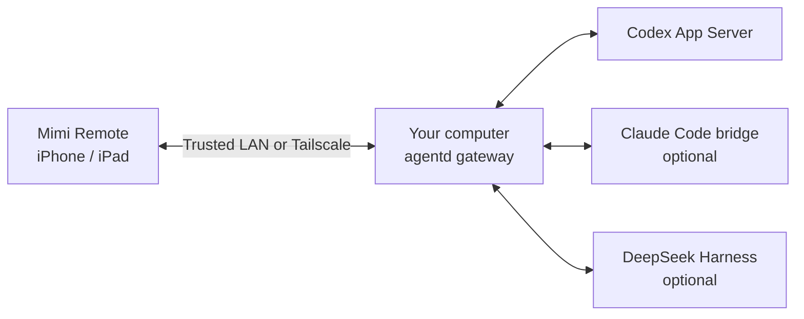

<h1 align="center">Mimi Remote</h1>

<strong>Continue your computer's agent sessions on iPhone and iPad.</strong>

An open-source mobile workspace for Codex, with optional Claude Code and DeepSeek Harness.

<a href="README.zh-CN.md">简体中文</a> · <a href="https://apps.apple.com/us/app/mimi-remote/id6778076511">App Store</a> · <a href="https://testflight.apple.com/join/jhGPbSk6">TestFlight</a> · <a href="https://github.com/gaixianggeng/mimi-remote/releases/latest">Host releases</a>

Your macOS, Windows, or Linux computer keeps running the agent, the projects, and the sessions. Mimi Remote connects to it over a trusted local network or Tailscale so you can keep working from your phone or tablet. Mimi Remote is an independent project, unaffiliated with OpenAI, Anthropic, DeepSeek, or Tailscale.

## What you can do

- **Continue the same conversation:** follow live replies, tool activity, and task status, then send a follow-up without re-explaining the project.
- **Stay in control:** answer prompts, handle approvals, queue the next instruction, or interrupt a running turn.
- **Finish the work:** with Codex, review changes and use Worktree and Git actions from the app.
- **Switch computers:** pair several hosts, each with its own credentials, and pick the active one in **Devices**. Sessions stay on the computer that owns them.
- **Use either screen:** a compact view on iPhone, a multi-column workspace on iPad.

 &nbsp;&nbsp;&nbsp; 

Screenshots show the Simplified Chinese interface with sample data. The app is also available in English.

## Get started

You need an iPhone or iPad on **iOS/iPadOS 18+** and a computer that stays awake while you connect: **macOS 15+**, **Windows 10/11 x64**, or **Linux** (x86_64 or ARM64 with a systemd user session).

1. Install and sign in to [Codex CLI](https://learn.chatgpt.com/docs/codex/cli) on that computer.
2. Install the host from [Releases](https://github.com/gaixianggeng/mimi-remote/releases/latest): `Mimi-Remote-Mac.dmg` on Mac, the `Mimi-Remote-Setup` installer on Windows, or the `linux` archive on Linux. The [installation guide](docs/install-upgrade-rollback.md) covers checksums, first-run setup, upgrades, and rollback.
3. Install the app from the [App Store](https://apps.apple.com/us/app/mimi-remote/id6778076511) where available, join [TestFlight](https://testflight.apple.com/join/jhGPbSk6), or [build it from source](ios/MimiRemote/README.md).
4. Open the host's pairing action and scan the QR code in the app. From a terminal, `agentd pair --qr-only` shows the code without printing the long-lived token.

To add another computer, repeat these steps on it. To let Codex install, upgrade, or diagnose the host for you, use the [install-mimi-remote Skill](packaging/skill/install-mimi-remote).

## Runtimes

| Runtime | On mobile | Setup |
| --- | --- | --- |
| **Codex** | Main runtime: sessions, live progress, approvals, task controls, and project tools. | Install and sign in to Codex CLI. |
| **Claude Code** (experimental) | Sessions and approvals, with fewer controls than Codex. No goals, archive, or fork. | Install and sign in to Claude Code. Mimi Remote Mac includes the bridge and turns it on once Claude Code is signed in; Linux and Homebrew hosts install the bridge separately ([Skill steps](packaging/skill/install-mimi-remote/SKILL.md)). |
| **DeepSeek Harness** | Text sessions and live progress. No attachments, Skills, plans, goals, or archive. | Run Harness on the host, then connect it from Mimi Remote Mac. Harness manages its own execution permissions. |

Technical details: [Claude bridge](docs/claude-bridge-architecture.md) · [DeepSeek Harness protocol](docs/deepseek-harness-protocol.md).

## How it works

On Windows, the Codex App Server listens on a loopback WebSocket and is not exposed directly to the LAN.

`agentd` on your computer authenticates the app and routes it to the selected runtime. There is no cloud account, session hosting, or application-level relay. Message notifications are on by default; they go through a small push service that receives only the APNs device token, anonymous short tags for the computer and session, the approval type, and an expiry, never prompts, code, or session content. See the [privacy policy](docs/privacy-policy.md). Keep `agentd` on a private network; do not expose its plain HTTP port to the public Internet.

Mimi Remote is a session client. It is not a remote shell, and it does not run agents on iOS. Sessions created in Codex Desktop's ordinary "This Mac" mode are not shared; connect Desktop through the [shared App Server](docs/shared-ssh-app-server.md) to continue them on mobile.

## Contributing

This repository contains the SwiftUI iPhone/iPad app, the Go `agentd` host, the Mac menu bar app, the Windows and Linux tray, and the Claude bridge. Start with [CONTRIBUTING.md](CONTRIBUTING.md) for checks and conventions, and the [iOS build guide](ios/MimiRemote/README.md) for the app. Maintainers run `bash ./scripts/verify-release.sh` before a formal release.

Report bugs and ideas in [GitHub Issues](https://github.com/gaixianggeng/mimi-remote/issues/new). Report vulnerabilities privately through [SECURITY.md](SECURITY.md). For help, see the [support page](docs/support.md).

## License

Mimi Remote's own code and documentation use [GPLv3 with an additional store-distribution permission](LICENSE). The [Claude bridge](bridges/claude/LICENSE) is GPLv3-only. Third-party notices are in [NOTICE.md](NOTICE.md) and [THIRD_PARTY_NOTICES.md](THIRD_PARTY_NOTICES.md). The license does not cover the Mimi Remote name or icons; see the [trademark policy](TRADEMARKS.md) and [terms of use](docs/terms-of-use.md).
