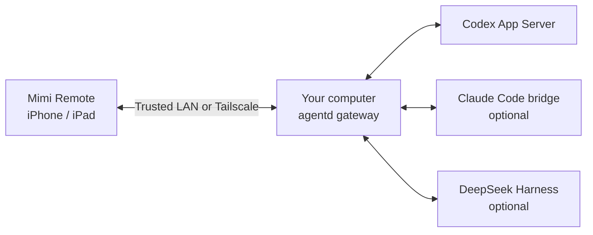

<p align="center"></p>

<h1 align="center">Mimi Remote</h1>

<p align="center"><strong>Continue your computer's agent sessions on iPhone and iPad.</strong></p>

<p align="center">An open-source mobile workspace for Codex, with optional Claude Code and DeepSeek Harness connections.<br />Pair your own computers, switch the active host, and keep working away from your desk.</p>

<p align="center"><a href="README.zh-CN.md">简体中文</a> · <a href="#get-started">Get started</a> · <a href="docs/install-upgrade-rollback.md">Host setup</a> · <a href="ios/MimiRemote/README.md">Build for iOS</a></p>

<p align="center"><a href="https://apps.apple.com/us/app/mimi-remote/id6778076511">App Store</a> · <a href="https://testflight.apple.com/join/jhGPbSk6">TestFlight</a> · <a href="https://github.com/gaixianggeng/mimi-remote/releases/latest">Host releases</a></p>

<p align="center"></p>

Mimi Remote lets you follow and control an agent session running on your macOS, Windows, or Linux computer. The iOS app connects over a trusted local network or Tailscale. Your computer keeps the project, runtime, and session; your phone or tablet gives you a focused view of the work in progress. Mimi Remote is an independent third-party project, unaffiliated with OpenAI, Anthropic, DeepSeek, or Tailscale.

## What you can do

- **Keep the same conversation:** read live replies, tool activity, and task status; send a follow-up without restating your project context.
- **Stay in control:** answer prompts, handle supported approvals, queue an instruction, or interrupt a running turn. Available controls depend on the runtime.
- **Work with projects:** browse sessions and, with Codex, inspect changes and use project, Worktree, and Git actions when you need to finish a task.
- **Switch computers:** save multiple host profiles with separate credentials, then select one active host in Devices. Sessions stay on their respective computers; Mimi Remote does not sync them between hosts.
- **Use the screen you have:** iPhone presents a compact session view; iPad opens the same supported capabilities in a wider, multi-column workspace.

<p align="center"> &nbsp;&nbsp;&nbsp; </p>

The preview and screenshots show the Simplified Chinese interface with Debug-only sample hosts, projects, and sessions. The app also supports English. They contain no live workspace content or credentials.

## Runtime support

Codex CLI is required for the normal host setup. Other runtimes are optional, configured separately on each host. Their feature sets are different:

| Runtime | Current mobile scope | Setup and limits |
| --- | --- | --- |
| **Codex** | Primary integration: sessions, live progress, approvals, task controls, and project tools. | Install and authenticate Codex CLI on the host. |
| **Claude Code** | Experimental session and approval bridge. | Install and authenticate Claude Code separately; enable the bridge. Fewer controls than Codex; no goal, archive, or fork. |
| **DeepSeek Harness** | Native text sessions and live progress. | Run Harness on the host and enable its connection. No attachments, Skills, plans, goals, or archive; Harness manages execution permissions. |

See the [Claude bridge](docs/claude-bridge-architecture.md) and [DeepSeek Harness integration](docs/architecture/harness-native-client.md) for technical boundaries. Match recent iOS and host builds for the features shown here; the public App Store build may trail TestFlight and source.

## Get started

You need an iPhone or iPad running **iOS/iPadOS 18+**, a computer that can stay on while you connect, and a trusted LAN or Tailscale connection. The Mac host requires **macOS 15+**; Windows supports **Windows 10/11 x64**. Check the [host installation guide](docs/install-upgrade-rollback.md) for current Linux requirements and package availability on each platform.

1. Install and authenticate [Codex CLI](https://learn.chatgpt.com/docs/codex/cli) on the computer that will run your projects.
2. Install the [Mimi Remote host release](https://github.com/gaixianggeng/mimi-remote/releases/latest) using the [platform guide](docs/install-upgrade-rollback.md). Start it and confirm that its service is ready.
3. Install the iOS app from the [App Store](https://apps.apple.com/us/app/mimi-remote/id6778076511) where available, join [TestFlight](https://testflight.apple.com/join/jhGPbSk6), or [build from source](ios/MimiRemote/README.md).
4. Open the host's pairing action and scan its short-lived QR code in the app. CLI users can run `agentd pair --qr-only`, which displays a QR code without printing a long-lived access token. Open a session to verify that replies appear on mobile.

To add another computer, repeat host setup and pairing, then switch to it in **Devices**. The host must remain awake and privately reachable. Do not expose `agentd`'s plain HTTP endpoint to the public Internet.

## How it works



The host gateway authenticates the mobile connection and connects it to the selected runtime. Mimi Remote does not provide cloud accounts, session hosting, or an application-level relay. Network infrastructure and services you choose, including Tailscale, Codex, Claude Code, DeepSeek Harness, GitHub, voice transcription, and MCP, follow their own data practices. Optional Lock Screen approval reminders use a small push service; they are off by default. See the [privacy policy](docs/privacy-policy.md) for what that service receives.

On Windows, the Codex App Server uses a loopback WebSocket transport and is not exposed directly to the LAN.

Mimi Remote is a session client, not a general-purpose remote shell, and it does not run agents inside iOS. Codex Desktop's ordinary “This Mac” sessions are not automatically shared with its App Server. [Shared App Server setup](docs/shared-ssh-app-server.md) explains the supported Desktop connection. For setup and recovery, use the [installation guide](docs/install-upgrade-rollback.md); for security reports, use [SECURITY.md](SECURITY.md).

## Build and contribute

This repository contains the SwiftUI iPhone/iPad app, the Go `agentd` host, Mac and desktop host apps, and the Claude bridge. Start with the [iOS build guide](ios/MimiRemote/README.md), [host installation and development guide](docs/install-upgrade-rollback.md), or [contribution guide](CONTRIBUTING.md). Report reproducible bugs and feature requests in [GitHub Issues](https://github.com/gaixianggeng/mimi-remote/issues/new).

Before submitting a change, preview and run the repository's selected checks:

```bash
bash ./scripts/verify-change.sh --plan
bash ./scripts/verify-change.sh
```

For a formal release, run `bash ./scripts/verify-release.sh` separately from the change checks.

Mimi Remote's own code and documentation use [GPLv3 with an additional store-distribution permission](LICENSE). The [Claude bridge](bridges/claude/LICENSE) remains GPLv3-only; third-party licenses are listed in [NOTICE.md](NOTICE.md) and [THIRD_PARTY_NOTICES.md](THIRD_PARTY_NOTICES.md). The code license does not grant rights to the Mimi Remote name or icons; see the [trademark policy](TRADEMARKS.md). Also see the [terms](docs/terms-of-use.md) and [support page](docs/support.md).
