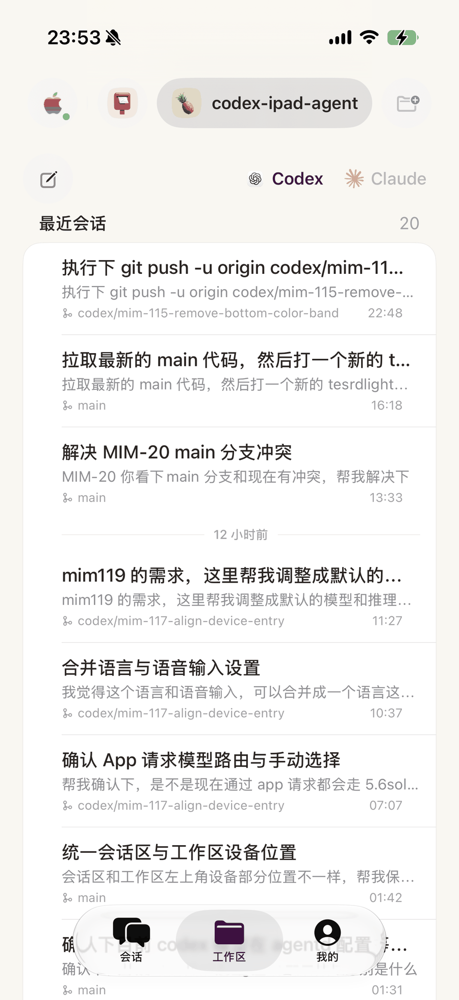
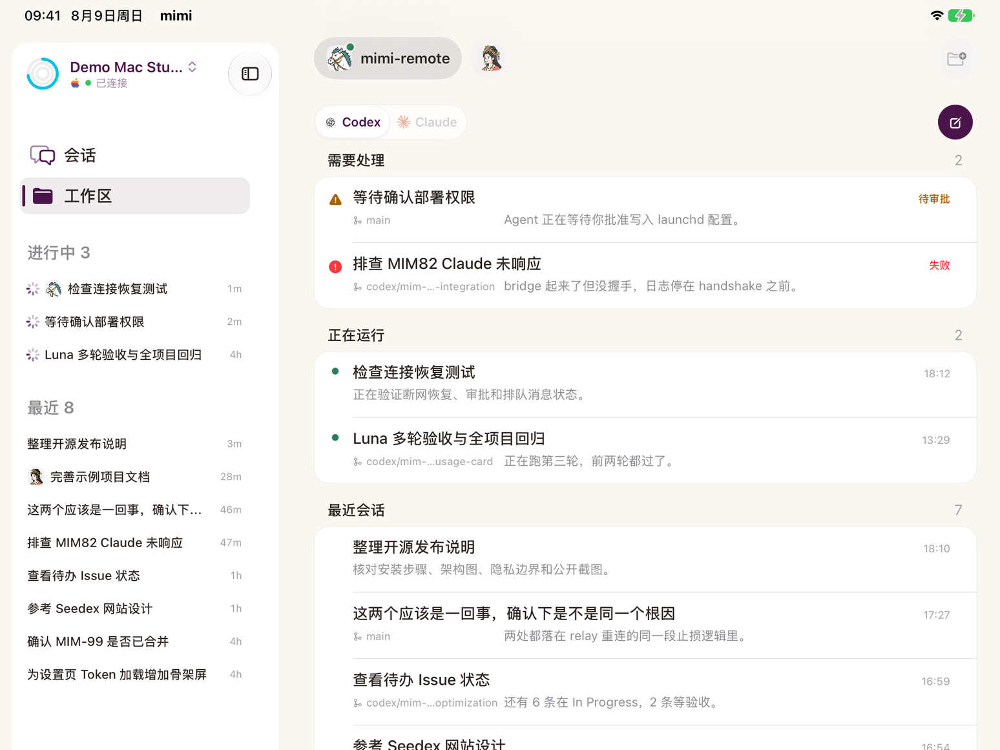
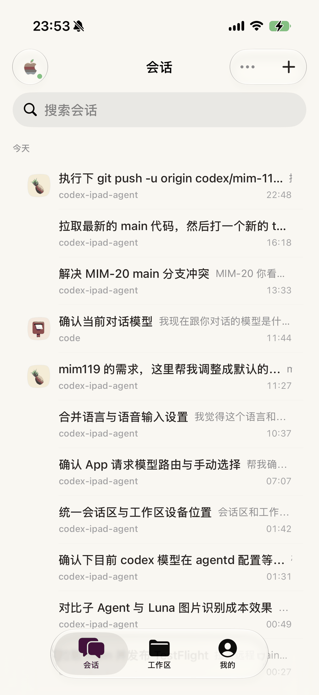
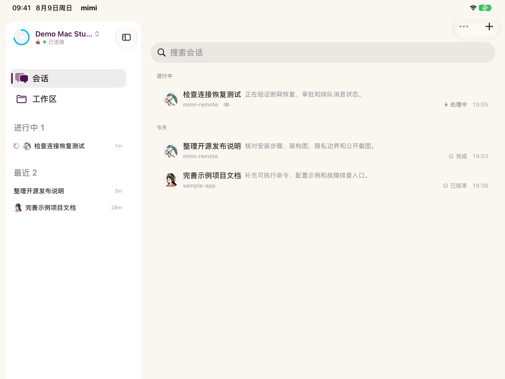
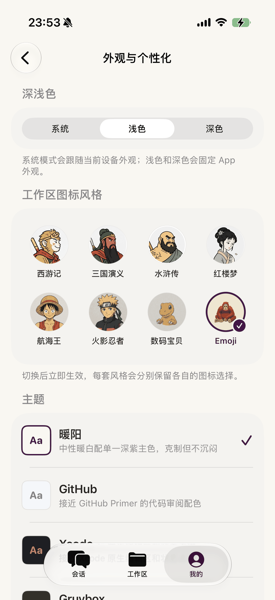
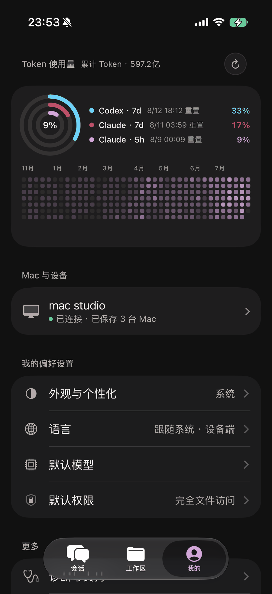
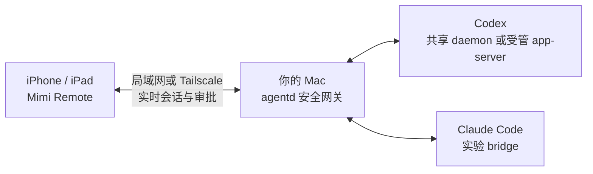

<p align="center">
  
</p>

<h1 align="center">Mimi Remote</h1>

<p align="center">
  <strong>Mac 上的 Agent 会话，接着在 iPhone 和 iPad 上用。</strong>
</p>

<p align="center">
  面向 Codex 与 Claude Code 的开源原生移动工作台。<br />
  直连你的 Mac，让会话在设备间无缝接力，实时跟进任务、继续对话和处理审批。
</p>

<p align="center">
  <a href="README.md">English README</a>
  &nbsp;·&nbsp;
  <a href="#快速开始">快速开始</a>
  &nbsp;·&nbsp;
  <a href="#架构">工作原理</a>
  &nbsp;·&nbsp;
  <a href="#常见问题faq">常见问题</a>
</p>

<p align="center">
  <a href="ios/MimiRemote/README.md"></a>
  <a href="ios/MimiRemote"></a>
  <a href="https://github.com/gaixianggeng/mimi-remote/actions/workflows/go-ci.yml"></a>
  <a href="LICENSE"></a>
</p>

<table>
  <tr>
    <td width="33%" valign="middle" align="center">
      
    </td>
    <td width="67%" valign="middle" align="center">
      
    </td>
  </tr>
</table>

<p align="center">
  <sub>当前 Mimi Remote iPhone 与 iPad 工作区：能力一致，布局分别适配。</sub>
</p>

Mimi Remote 通过 Tailscale 或同一局域网直连用户自己的 Mac。项目不运营中转服务、云账号或会话托管服务，Mac 始终是控制平面；用户主动发送给 Codex、Claude Code、GitHub、语音转写或 MCP 的数据，仍会按对应第三方服务的处理方式与条款处理。

Mimi Remote 是独立开发的第三方项目，不隶属于 OpenAI、Anthropic 或 Tailscale，也不代表这些公司的官方产品。Codex 是主要支持的 Runtime；可选的 Claude Code bridge 仍处于实验阶段。

> 当前还没有公开 App Store 版本。可以通过 [TestFlight](https://testflight.apple.com/join/jhGPbSk6) 安装 iOS App，也可以从源码构建。

<table>
  <tr>
    <td width="50%" align="center">
      <strong>iPhone · 完整能力，紧凑布局</strong><br />
      <sub>在单列界面中继续会话、跟进进度、处理审批和控制任务。</sub>
    </td>
    <td width="50%" align="center">
      <strong>iPad · 完整能力，展开布局</strong><br />
      <sub>同样的会话与控制在多栏工作台中展开，保留更多上下文。</sub>
    </td>
  </tr>
  <tr>
    <td width="50%" valign="top" align="center">
      
    </td>
    <td width="50%" valign="top" align="center">
      
    </td>
  </tr>
</table>

两端共用完整的会话、审批与任务控制能力，区别只在布局、信息密度和输入方式。原生 SwiftUI 界面分别打磨了紧凑导航、宽屏分栏、触控反馈与过渡动画；开启 Reduce Motion 后，动态效果会降级为克制的淡化或静态反馈。这些图片直接复用 [`web/assets`](web/assets) 中的当前官网截图，全部来自 Debug 专用种子界面，其中的主机、项目、会话、路径和用量均为演示数据，不使用维护者的真实工作区或凭据。截图展示简体中文界面，App 同时支持英文。

## 从 Mac 到移动端，会话继续

真正高频的需求通常不是“在手机上开一个终端”，而是离开 Mac 后仍能接着同一段 Agent 会话，不必重新解释上下文。

- **接着做：**在 Mac、iPhone 与 iPad 之间继续已有会话，离开工位也不用重新开始。
- **实时跟进：**查看任务正在思考、等待、失败还是已经完成，并持续读取结构化回复和执行过程。
- **随时控制：**追加上下文、排队下一条指令、切换模型或推理强度、回答问题、批准操作或中断当前 Turn。

需要完成更深入的开发收尾时，进阶工具还支持检查 Diff、管理 Worktree、按文件或 Hunk 暂存、Commit、Push 和创建 Draft PR；这些能力不是使用 Mimi Remote 的前提。

## 它不是口袋里的终端

- Codex 与 Claude Code 的消息、推理、命令、Tool 调用、审批和执行过程会组成结构化时间线，不是一整屏终端日志。
- 新建 Codex 会话由 Mac 端异步生成简短标题；生成失败不会阻塞对话，可通过 `app_server.auto_title` 关闭。
- 模型、推理强度、Skill、速度、权限模式和待发送队列都留在 Composer 附近。
- Markdown、图片、文件引用、语音输入和安全的 Quick Look 读取都按移动端内容呈现。
- iPhone 与 iPad 的间距、层级、触控反馈和转场动画分别调校；Reduce Motion 下仍保留清晰的静态状态反馈。
- 多个 Mac Profile 使用独立 Keychain Token；同一时间只保持一个活动连接，心智模型更简单。
- 就绪检查、断线恢复、Doctor 和有上限的日志导出，让多数故障不必回到电脑前处理。

当前不做云端账号、代码托管、公网中继、任意远程 Shell、后台无人值守删除或多用户共享。完整边界见 [项目现状](docs/project-status.md)。

## 设计围绕上下文，不围绕屏幕尺寸

Mimi Remote 在不同设备上沿用同一套项目与会话模型，但界面会顺着设备的真实使用方式变化：iPhone 用紧凑层级保持单手操作，iPad 展开为保留上下文的多栏工作台，Mac 则继续运行 Agent 并提供宿主控制面。设备改变的是呈现方式，不是可用能力。

<table>
  <tr>
    <td width="50%" align="center">
      <strong>外观与个性化是一等能力</strong><br />
      <sub>可选择深浅色、工作区图标套装和编辑器风格主题。</sub>
    </td>
    <td width="50%" align="center">
      <strong>用量与宿主状态集中可见</strong><br />
      <sub>Token 周期、已连接 Mac、语言、模型和权限集中在「我的」。</sub>
    </td>
  </tr>
  <tr>
    <td width="50%" valign="top" align="center">
      
    </td>
    <td width="50%" valign="top" align="center">
      
    </td>
  </tr>
</table>

<p align="center">
  
</p>

<p align="center">
  <sub>340pt 的 Mac 菜单栏窗口把宿主健康状态、Codex / Claude 运行时、额度环、配对、诊断和恢复动作放在一次点击内。</sub>
</p>

这套层级有几个明确原则：

- **保留上下文：**iPhone 用紧凑层级把当前任务放在手边；iPad 侧栏持续展示项目和会话，右侧内容按任务变化；两端切换布局但不削减会话能力。
- **渐进披露复杂度：**高频状态和动作靠近任务，首次设置、配对、诊断和深层偏好进入独立界面。
- **先看状态，再做动作：**连接健康度、Runtime 就绪状态、剩余额度和权限模式会先于可能改变或中断任务的控制项出现。
- **遵循各平台习惯：**iPhone 是紧凑触屏层级，iPad 是多栏工作台，Mac 是高密度菜单栏工具，而不是把一套布局拉伸到三块屏幕。

上面的移动端图片与当前 Mimi Remote 官网共用同一套素材，并且全部来自 Debug 专用种子界面。Mac 菜单图使用公开演示域名 `mimi-demo.local`；采集过程没有重启或替换已安装的 Mac 服务。这些公开截图均不包含真实 Token、私有地址、个人路径或线上项目内容。

## 架构



这个仓库包含完整链路：iPhone / iPad 原生 App、Mac 菜单栏宿主、Go `agentd` 网关，以及 Claude Code 兼容 bridge。移动端只连接你自己的 Mac，项目文件、会话历史和 Runtime 凭证都留在宿主机。

- **直连、响应快：**通过私有网络上的 REST 与 WebSocket 实时传递输出、追问、任务控制和审批，不经过 Mimi 运营的应用层中转。
- **真正的会话接力：**Codex 可选择与 Codex Desktop 共用官方 local daemon，让 Mac 上空闲的原会话无需 fork 就能在移动端继续；默认和回滚链路仍使用独立受管 app-server。
- **双 Runtime、统一体验：**Codex 是主 Runtime；可选的 Claude Code bridge 把会话与审批适配到同一套结构化移动界面。
- **边界小而明确：**`agentd` 在 Mac 上完成认证、工作区授权和 Runtime 路由。Mac 需要保持唤醒并能从私有网络访问。

协议细节与准确能力边界见[项目现状](docs/project-status.md)、[Codex 共享 daemon](docs/codex-shared-daemon.md)和 [Claude bridge 架构](docs/claude-bridge-architecture.md)。

## 开始前检查

安装前先确认：

- **必需：**一台运行 iOS / iPadOS 18 或更高版本的 iPhone / iPad、一台可持续运行宿主服务的受支持电脑，以及已在宿主电脑安装并可用的 Codex CLI。Runtime 自身的认证只需在宿主完成；Mimi Remote 只连接 `agentd` 网关，不接收或管理 Runtime 凭证与计费。认证方式见 [Codex 官方认证文档](https://learn.chatgpt.com/docs/auth)。iOS 26+ 保留完整的 Liquid Glass 与 Apple 设备端实时语音体验；iOS 18–25 使用更普通的系统材质，并回退到 Codex 录音转写。
- **网络：**设备位于同一可信局域网时可以直连，不要求安装 Tailscale；跨网络时使用同一 Tailnet，或使用用户自行管理的安全 HTTPS 入口。不要把 `agentd` 的明文 HTTP 端口直接暴露到公网。
- **可选 Runtime：**Claude Code 是默认关闭的实验通道，不能替代 Codex。启用时需按 [Claude Code 官方安装与认证文档](https://docs.anthropic.com/en/docs/claude-code/getting-started)单独安装和认证，Codex CLI 仍然必需。
- **当前 iOS 安装方式：**尚无公开 App Store 包。可以通过 [TestFlight](https://testflight.apple.com/join/jhGPbSk6) 安装；也可以使用 Mac、带 iOS 26 SDK 的 Xcode 26 或更高版本和 XcodeGen 从源码构建，详见 [iOS 构建说明](ios/MimiRemote/README.md)。
- **仅开发者需要：**普通 Windows / macOS 用户从 [GitHub Releases](https://github.com/gaixianggeng/mimi-remote/releases/latest)安装宿主时不需要 Go 或 Rust；只有从源码开发后端或 bridge 时才需要。各平台细节见 [完整安装、升级与回滚文档](docs/install-upgrade-rollback.md)。

## 快速开始

### 首次安装只需四步

1. **准备 Codex：**在宿主电脑安装 Codex CLI，完成 Runtime 自身认证并确认已经就绪；Mimi Remote 不配置 Provider 凭证或计费。
2. **安装并启动宿主：**从 [GitHub Releases](https://github.com/gaixianggeng/mimi-remote/releases/latest)安装 Windows 或 macOS 宿主，完成首次设置并确认服务已就绪。
3. **安装 iOS App：**加入 [Mimi Remote TestFlight](https://testflight.apple.com/join/jhGPbSk6)；开发者也可以按 [iOS 构建说明](ios/MimiRemote/README.md)从源码运行。
4. **扫码配对：**打开宿主的配对入口（或运行 `agentd pair --qr-only`），在 Mimi Remote 中扫描短期二维码。

推荐使用平台正式安装包：Windows 使用一键 EXE 安装器（有证书时使用 Authenticode 签名；无证书时明确标记为 `unsigned-release`），macOS 使用 Developer ID 签名并经过 Apple 公证的菜单栏宿主 App。两者都内置 Go 后端和兼容 Claude bridge；Homebrew 保留给 macOS 命令行、服务器、自动化和故障恢复。

### Windows 安装

要求 Windows 10/11 x64，并已在当前 Windows 用户下安装和登录 Codex CLI。普通用户从 [GitHub Releases](https://github.com/gaixianggeng/mimi-remote/releases/latest) 下载同版本的 `Mimi-Remote-Setup-*.exe`、`.sha256` 和 `.metadata.json`，先在 PowerShell 验证 SHA-256 与 Authenticode：

```powershell
$setup = Get-Item .\Mimi-Remote-Setup-*.exe
(Get-FileHash $setup -Algorithm SHA256).Hash
(Get-AuthenticodeSignature $setup).Status
```

先检查 `.metadata.json` 的 `signing`：`authenticode-pfx` 必须对应 `Valid`；`unsigned-release` 应对应 `NotSigned`，其 EXE 文件名包含 `-unsigned`，并可能触发 Microsoft Defender SmartScreen。未签名版本只应从本仓库正式 Release 下载，并在 SHA-256 与同 Release 的 sidecar 完全一致后运行。安装器按当前用户安装，已经内置 `agentd.exe`、`alleycat-claude-bridge.exe` 与原生 `mimi-remote-tray.exe`，不要求 Go 或 Rust；它会注册 limited 权限的登录任务、启动服务、等待真实就绪并启动通知区域托盘。托盘可查看 Endpoint 与 Codex/Claude 状态，并提供启动、停止、重启、配对、Doctor 和日志入口。配置与 Token 位于 `%APPDATA%\mimi-remote`，日志位于 `%LOCALAPPDATA%\Mimi Remote\logs`，覆盖升级或普通卸载不会删除它们。

局域网访问默认关闭；没有 Tailscale 且没有明确勾选 LAN 时，新安装只监听 loopback。勾选后，安装器先要求默认 Windows 网络配置文件为“专用网络”，清理 Windows 弹窗可能为 `agentd.exe` 自动创建的额外入站规则，再创建唯一的 Private profile、LocalSubnet 受限规则，最后扩大到 LAN 监听。运行时会拒绝 Public/Any 或其它非托管入站 Allow 规则。Public 网络不会触发放宽防火墙边界；只应把可信的 Wi-Fi 或以太网改为“专用网络”。配对地址优先使用系统默认路由对应的物理网卡，并排除 Hyper-V、WSL、容器和仅 VPN 可见的虚拟网卡。也可以使用以下命令：

```powershell
$agentd = "$env:LOCALAPPDATA\Programs\Mimi Remote\agentd.exe"
& $agentd status
& $agentd pair --qr-only
& $agentd doctor --fix
& $agentd logs -n 200
& $agentd restart --no-pair
```

### Mac 安装

要求：

- macOS 26 或更高版本；
- 已安装并登录 Codex CLI；
- Mac 与 iPhone / iPad 位于同一私有网络；跨网络使用时建议加入同一个 Tailscale 网络。

普通用户从 [GitHub Releases](https://github.com/gaixianggeng/mimi-remote/releases/latest) 下载 `Mimi-Remote-Mac.dmg` 和对应 SHA-256 文件，校验后打开 DMG，把 **Mimi Remote Mac** 拖到“应用程序”，再从菜单栏完成首次设置。App 已内置 `agentd` 和兼容的 Claude bridge，不要求 Homebrew、Go、Rust 或 Xcode。

已有 Homebrew 服务时，让 Mac App 执行接管；迁移过程会先跑 Doctor，失败时尝试恢复旧服务，并保留现有配置、Token 和配对关系。

命令行、服务器或恢复场景才使用 Homebrew：

```bash
brew update
brew install gaixianggeng/tap/mimi-remote

codex --version
codex app-server --help
agentd up
```

`agentd up` 会生成用户私有配置和两层独立 Token，启动后台服务，等待真实 app-server WebSocket 就绪，然后在终端显示短期配对二维码。检测到 Tailscale 时优先使用 Tailscale；否则自动启用局域网，并把当前私有局域网地址写入配对信息。

Homebrew / CLI 常用命令：

```bash
agentd status
agentd pair
agentd doctor --fix
agentd logs -n 200
agentd up --no-pair
agentd restart
agentd restart --no-pair
agentd stop
```

`agentd restart` 在 macOS 上使用 launchd 原子重启，允许从当前服务托管的远程任务安全触发；不要在这类任务中直接运行 `brew services restart mimi-remote`。
Agent、自动化或远程日志场景使用 `agentd up --no-pair` / `agentd restart --no-pair`，避免把二维码、Endpoint 和长期访问码写入任务输出。`agentd up --no-pair --json` 只返回版本、就绪状态和安全警告，不包含完整 setup 结果；需要配对时再由用户在本机终端运行 `agentd pair --qr-only`。

Windows、macOS 与 Linux 的完整升级和恢复步骤见 [安装、升级与回滚](docs/install-upgrade-rollback.md)。

如果希望由 Codex 按同一套权限最小化、可恢复流程完成安装、升级和诊断，可以让 `$skill-installer` 安装下面的 GitHub Skill 路径：

```text
https://github.com/gaixianggeng/mimi-remote/tree/main/packaging/skill/install-mimi-remote
```

每个 GitHub Release 也会附带 `install-mimi-remote.zip` 和对应 SHA-256 文件，便于固定版本下载与审计。

### 安装 iOS App

Mimi Remote 要求 iOS / iPadOS 18 或更高版本。最简单的安装方式是加入 [Mimi Remote TestFlight](https://testflight.apple.com/join/jhGPbSk6)。iOS 26+ 提供完整高级视觉与设备端语音体验；较早的受支持系统会对不可用能力进行明确降级。

如需从源码构建，请使用安装了 Xcode 26 或更高版本和 XcodeGen 的 Mac：

```bash
xcodegen generate \
  --spec ios/MimiRemote/project.yml \
  --project ios/MimiRemote

open ios/MimiRemote/MimiRemote.xcodeproj
```

在 Xcode 中选择 `MimiRemote` scheme、开发者 Team 和目标 iPhone / iPad 后运行。工程支持 iOS / iPadOS 18 或更高版本；仍需使用带 iOS 26 SDK 的现代 Xcode 编译，以便同时保留新系统高级能力。

Mac App 用户从菜单栏选择“配对设备…”，CLI 用户扫描 `agentd up` 或 `agentd pair` 显示的二维码。二维码使用 10 分钟有效的签名票据，同一二维码或复制链接可在有效期内重复兑换，且不直接包含长期 Token；扫码不可用时可以展开高级手动连接。

## Claude Code 实验通道

Claude Runtime 默认关闭，当前要求 `alleycat-claude-bridge >= 0.2.1`。正式 Windows 安装器和 Mac DMG 都已经内置兼容 bridge；Windows `authenticode-pfx` 安装包与 Mac DMG 保留平台代码身份，`unsigned-release` Windows 包则没有。不要为这些安装方式重复执行 `cargo install`。

只有 Homebrew、Linux 或独立开发环境需要从源码安装外置 bridge：

```bash
cargo install --git https://github.com/gaixianggeng/mimi-remote.git \
  --locked --force --bin alleycat-claude-bridge alleycat-claude-bridge

command -v alleycat-claude-bridge
```

在用户配置中显式启用：

```json
{
  "claude": {
    "enabled": true,
    "bridge_bin": "",
    "args": [],
    "max_concurrent_bridges": 3,
    "env": {
      "TERM": "xterm-256color"
    }
  }
}
```

空 `bridge_bin` 表示使用 Windows 安装器或 Mimi Remote Mac 随包 bridge；Homebrew 和 Linux 必须改成 `command -v alleycat-claude-bridge` 返回的绝对路径。配置文件含长期 Token，修改前必须创建用户私有备份，只用 JSON 解析器修改 `claude` 字段，保持平台对应的用户私有权限，不要把完整文件打印到日志或聊天中。

然后验证：

```bash
go run ./scripts/ipad-ws-probe.go \
  -endpoint http://127.0.0.1:8787 \
  -token "$AGENTD_TOKEN" \
  -cwd "$PWD" \
  -runtime claude \
  -models-only
```

修改配置后必须从当前 service owner 重启：Mimi Remote Mac 使用菜单栏“重新启动服务”，Homebrew 使用 `agentd restart --no-pair`，Linux 使用 user-systemd。随后运行 Doctor，并在移动端确认 Runtime 选择器出现 Claude，且 Codex 主通道仍可用。上面的源码探针只用于开发仓库中的本机调试，不要把 Token 写进聊天或持久日志。

Claude 通道仍是实验能力：不支持 `goal`、`archive`、`fork`、APNs 后台推送和跨设备云同步。普通断线通过事件 replay 或 `thread/read` 恢复，不自动重试写操作；bridge/Mac 重启后的极短未落盘窗口仍可能无法恢复。

## 从源码开发

### Go 后端

要求 Go `1.25.0`：

```bash
go test ./...
go vet ./...

# 前台调试，不替换 Homebrew 服务
go build -trimpath -o bin/agentd ./cmd/agentd
./bin/agentd setup --scan-root "$HOME/code" --browse-root "$HOME"
./bin/agentd serve
```

已经通过 Homebrew 运行 `agentd` 时，不要把未签名的 `go build` 产物直接覆盖到 Cellar。macOS 会把 Go 的 ad-hoc 签名绑定到本次构建的 `cdhash`，下一次编译后可能重新请求“文件与文件夹”或“完全磁盘访问”授权。使用仓库内的完整开发重启入口：

```bash
# 本机终端：等待新服务通过 readyz
bash ./scripts/restart-agentd-dev-macos.sh

# 从 iPad/Codex 远程发起：先交给独立 launchd job，再让旧连接退出
bash ./scripts/restart-agentd-dev-macos.sh --no-wait

# 重连后查看结果；失败会自动恢复旧二进制
bash ./scripts/restart-agentd-dev-macos.sh --status
```

脚本使用本机 `Apple Development` 证书和固定 identifier 签名，原子替换 Homebrew 二进制，通过独立 launchd job 执行 kickstart、`readyz` 验证和失败回滚。新进程会在启动最前面异步预检项目、`scan_roots`、`browse_roots`；当 `browse_roots` 覆盖当前 Home 时，还会主动探测 Desktop、Documents、Downloads，尽早触发 macOS 的“文件与文件夹”提示。预检不会递归读取文件，也不会因等待人工点击而阻塞远程服务恢复；结果显示在 `agentd status --json` / Doctor 和服务日志中。

macOS 没有可由后台服务自动申请的“整个当前用户目录”单一授权：Desktop、Documents、Downloads 是分开的保护位置，其他 App 数据等还需要“完全磁盘访问”。第一次从旧 ad-hoc 版本切换到稳定签名时仍可能要求最后一次人工确认；真正需要无人值守访问整个 Home 时，请在“系统设置 → 隐私与安全性 → 完全磁盘访问”中一次性添加 `/opt/homebrew/opt/mimi-remote/bin/agentd`。同一证书和 identifier 下的后续本地构建可以复用授权。详细设计和排障见 [安装、升级与回滚](docs/install-upgrade-rollback.md)。

### iOS

```bash
xcodegen generate \
  --spec ios/MimiRemote/project.yml \
  --project ios/MimiRemote

bash ./scripts/ios-dev.sh build-for-testing
```

日常 `build` / `run` 按 available、paired 且未占用的 USB 真机 → 当前本地网络可达的真机 → 固定 iPad Simulator 确定性回退。显式 `IOS_DEVICE_ID` / `IOS_DEVICE_NAME` 同时支持有线与无线真机，设备不可达时会明确失败；同一 UDID 切换连接方式时仍共用租约和 DerivedData。测试、视觉快照与 CI 精确固定 `iPad Pro 13-inch (M5)`，不会回退 iPad mini。设备连接方式和占用可通过 `bash ./scripts/ios-dev.sh leases` 查看。iOS 工程结构、运行命令、Catalyst 和真机验收见 [iOS 开发说明](ios/MimiRemote/README.md)。

### Claude bridge

```bash
cargo test --locked \
  -p alleycat-codex-proto \
  -p alleycat-bridge-core \
  -p alleycat-claude-bridge

cargo install --locked \
  --path bridges/claude/crates/claude-bridge \
  --force \
  --bin alleycat-claude-bridge
```

bridge 只保留 Mimi Remote 需要的三个 crate；上游来源和 GPLv3-only 边界见 [Claude bridge 说明](bridges/claude/README.md)。

## 验证

先预览 committed、staged、unstaged 和未跟踪变更对应的验证计划；准备推送前只执行
一次 quick：

```bash
bash ./scripts/verify-change.sh --plan
bash ./scripts/verify-change.sh
```

纯文档和控制面改动不会启动语言构建；产品代码只验证直接受影响的栈，完整回归默认交给
PR Gate。跨模块、协议、发布或明确高风险改动再运行
`bash ./scripts/verify-change.sh --full`。相机、通知、Keychain、Tailscale/弱网、性能和
发布前验收才需要真机。分层规则和专项排障命令见[贡献指南](CONTRIBUTING.md)。

正式发布校验仍需独立于上述分层验证执行：

```bash
bash ./scripts/verify-release.sh
```

正式 macOS Release 必须通过 Developer ID 签名和 Apple notarization；发布链路另外包含签名凭据预检、Darwin 归档身份校验、打包、Linux 安装、Git 历史凭据扫描、Action SHA 固定和协议漂移门禁，详见 [P0 / P1 发布清单](docs/p0-p1-roadmap.md)。

## 仓库说明

- `gaixianggeng/mimi-remote` 是唯一的完整开源源码与新版本发布仓库，包括 iOS App、Mac App、Go `agentd`、Claude bridge、测试、文档和发布脚本。
- 原完整源码仓库与同名历史归档的一次性切换按[仓库改名 runbook](docs/operations/github-repository-rename-runbook.zh-CN.md)执行；历史 `v0.1.0`–`v0.2.2` 产物离线备份，不再维护第二个在线镜像。

源码目录保持语言和职责清晰，同时避免为目录整齐大规模改写稳定构建路径：

```text
ios/MimiRemote/          SwiftUI iPhone / iPad App
cmd/agentd/ + internal/  Go 安全网关与 Codex / Claude 控制面
bridges/claude/          Rust Claude Code 协议 bridge
```

新的 Mac、Go、Linux、Homebrew 和 Skill 产物统一由 `gaixianggeng/mimi-remote` Release 发布。

## 常见问题（FAQ）

### Can I use Codex on an iPad or iPhone? / 可以在 iPad 或 iPhone 上使用 Codex 吗？

可以。Codex CLI 和工作区仍运行在你的 Mac 上，Mimi Remote 通过 `agentd` 提供原生移动端界面。它是 Codex 的 iPhone / iPad 远程客户端，不是在 iOS 沙盒内直接运行完整 CLI。

### Is Mimi Remote self-hosted and local-first? / 这是自托管、本地优先的吗？

是。移动端通过 Tailscale 或同一局域网访问你自己的 `agentd`，项目维护者不运营中转服务。源代码、会话、日志以及 Codex / Claude 凭证留在你的设备上。

### Does it support Claude Code? / 支持 Claude Code 吗？

支持实验通道。`agentd` 可以调用仓库内的 [Claude bridge](bridges/claude)，把同一套移动端会话与审批界面连接到 Claude Code headless。该能力默认关闭，功能边界见 [Claude bridge 架构](docs/claude-bridge-architecture.md)。

### Is this an official OpenAI or Anthropic app? / 这是官方 App 吗？

不是。Mimi Remote 是采用 GNU GPLv3 并附 App Store / Google Play 分发例外的第三方开源项目，与 OpenAI、Anthropic 和 Tailscale 均无隶属或背书关系。

### How does the app differ before iOS / iPadOS 26? / iOS 26 之前有什么区别？

Mimi Remote 支持 iOS / iPadOS 18 及以上版本。iOS 26+ 继续使用 Liquid Glass、系统共享玻璃背景和 Apple 设备端实时语音；iOS 18–25 保留核心会话、工作区、附件与连接能力，但使用普通系统材质，并把不支持的 Apple 实时语音入口回退到 Codex 录音转写。兼容层只处理系统能力差异，不复制业务逻辑。

## 参与项目

- 遇到 Bug 或有功能建议，请创建 [GitHub Issue](https://github.com/gaixianggeng/mimi-remote/issues/new)。
- 提交代码前请阅读 [贡献指南](CONTRIBUTING.md)，并尽量附上可复现步骤或验证结果。
- 如果 Mimi Remote 确实解决了你的问题，可以给仓库一个 Star；它会帮助更多正在搜索 Codex iPad client、Codex remote 或 Claude Code iOS client 的开发者找到这个项目。

## 文档

- [项目现状与关键决策](docs/project-status.md)
- [P0 / P1 发布清单](docs/p0-p1-roadmap.md)
- [Nightly 与正式发布](docs/nightly-release.md)
- [安装、升级与回滚](docs/install-upgrade-rollback.md)
- [Tailscale 与 Peer Relay 运维](docs/tailscale-peer-relay-ops.md)
- [Codex 协议支持边界](docs/codex-protocol-support.md)
- [Capability 声明与本地降级](docs/capability-rollout.md)
- [Claude bridge 架构](docs/claude-bridge-architecture.md)
- [与 Litter 的能力对照](docs/litter-comparison.md)
- [隐私政策](docs/privacy-policy.md)
- [使用条款](docs/terms-of-use.md)
- [支持说明](docs/support.md)
- [安全政策](SECURITY.md)

## 隐私与安全

Mimi Remote 不包含广告、分析 SDK 或开发者自建遥测，不把项目内容、对话、日志、代码或 Token 上传到项目维护者服务器。用户主动启用的 Codex、Claude Code、GitHub、Codex 语音转写或 MCP 等第三方能力仍受各自服务条款约束；Apple 语音输入使用设备端 SpeechAnalyzer 处理。

请不要在公开 Issue、PR、日志或截图中提交真实 Token、Tailscale IP、私有工作目录或项目内容。安全问题请按 [SECURITY.md](SECURITY.md) 私下报告。

## License

Mimi Remote 自有的 iOS App、Go 后端和文档使用 [GNU GPLv3](LICENSE)，并依据 GPLv3 第 7 节授予通过 Apple App Store 和 Google Play 分发的额外许可。商业使用并未被禁止，但分发修改版或二进制时仍须遵守 GPLv3，包括向接收者提供对应源码和同等许可。

[`bridges/claude`](bridges/claude) 源自 Alleycat 多位贡献者，保留独立的 [GPLv3-only](bridges/claude/LICENSE)；仓库根目录的商店分发额外许可不适用于这部分上游代码。

此前已经明确以 MIT License 发布的历史版本继续受其原有许可；本次变更不追溯撤销已经授予的权利。第三方版权与许可证正文见 [NOTICE.md](NOTICE.md) 和 [THIRD_PARTY_NOTICES.md](THIRD_PARTY_NOTICES.md)。
