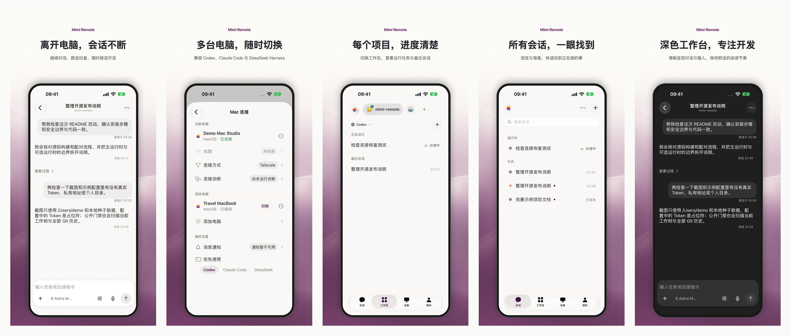
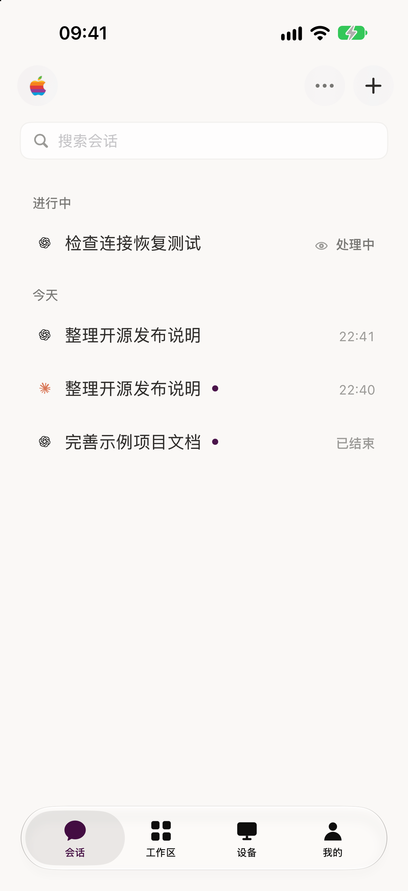
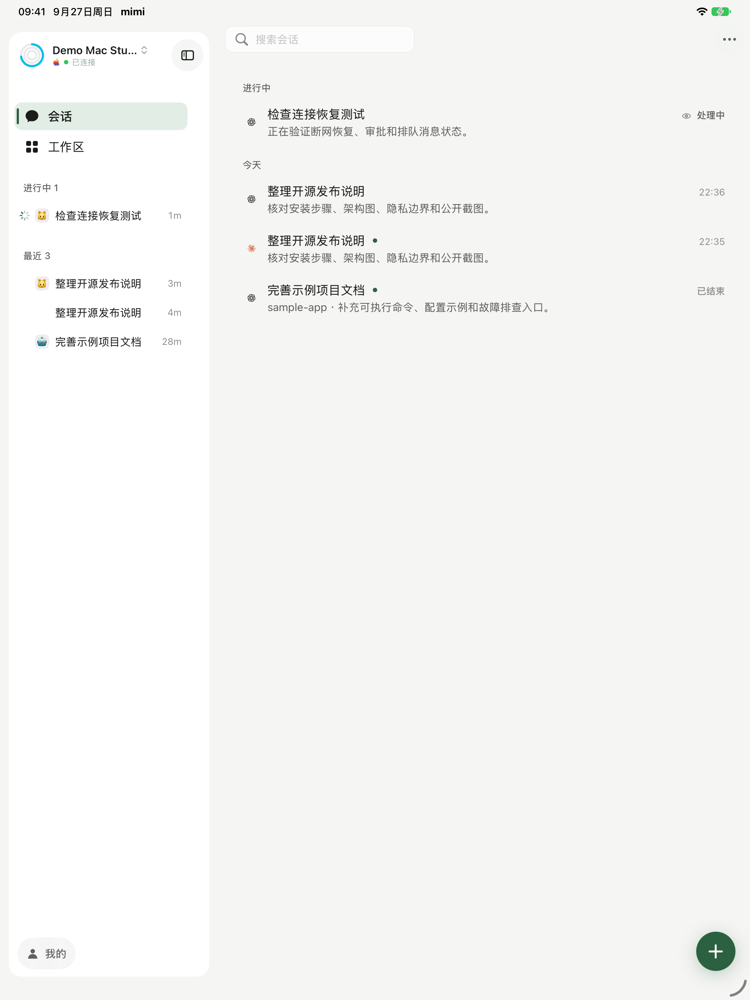
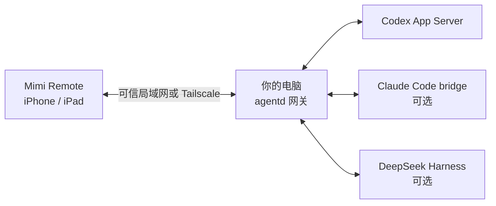

<p align="center"></p>

<h1 align="center">Mimi Remote</h1>

<p align="center"><strong>电脑上的 Agent 会话，接着在 iPhone 和 iPad 上用。</strong></p>

<p align="center">以 Codex 为主、可选接入 Claude Code 和 DeepSeek Harness 的开源原生移动工作台。<br />配对自己的多台电脑，切换当前连接，离开工位也能继续工作。</p>

<p align="center"><a href="README.md">English</a> · <a href="#快速开始">快速开始</a> · <a href="docs/install-upgrade-rollback.md">宿主安装</a> · <a href="ios/MimiRemote/README.md">iOS 源码构建</a></p>

<p align="center"><a href="https://apps.apple.com/us/app/mimi-remote/id6778076511">App Store</a> · <a href="https://testflight.apple.com/join/jhGPbSk6">TestFlight</a> · <a href="https://github.com/gaixianggeng/mimi-remote/releases/latest">宿主安装包</a></p>

<p align="center"></p>

Mimi Remote 让你在手机或平板上跟进、控制运行在 macOS、Windows 或 Linux 电脑上的 Agent 会话。iOS App 通过可信局域网或 Tailscale 连接宿主；项目、运行时和会话留在电脑上，移动端提供适合触屏的工作界面。这是独立第三方项目，与 OpenAI、Anthropic、DeepSeek 和 Tailscale 没有隶属或背书关系。

## 能做什么

- **接着同一段对话：**查看实时回复、工具活动和任务状态；离开电脑后继续追问，不用重新交代项目背景。
- **随时控制：**回答问题、处理受支持的审批、排队下一条指令或中断当前任务。具体操作取决于所选运行时。
- **处理项目工作：**浏览项目和会话；使用 Codex 时还可检查改动，并在需要时使用 Worktree、Git 等工具完成任务。
- **切换电脑：**保存多台宿主，每台使用独立凭据，在「设备」中选择一台当前连接。会话仍属于各自的电脑，不会跨宿主同步。
- **适应屏幕：**iPhone 使用紧凑的会话界面；iPad 将同样受支持的能力展开为多栏工作台。

<p align="center"> &nbsp;&nbsp;&nbsp; </p>

上面的宣传图和截图展示简体中文界面，使用 Debug 专用的示例电脑、项目与会话，不含真实工作区内容或凭据。App 也支持英文。

## 运行时支持

常规宿主安装需要 Codex CLI。其他运行时由每台宿主单独配置，功能范围并不相同：

| 运行时 | 当前移动端能力 | 配置与限制 |
| --- | --- | --- |
| **Codex** | 主通道：会话、实时进度、审批、任务控制和项目工具。 | 在宿主安装并登录 Codex CLI。 |
| **Claude Code** | 实验性会话与审批 bridge。 | 单独安装并登录 Claude Code，再启用 bridge；控制能力少于 Codex，不支持目标、归档和 fork。 |
| **DeepSeek Harness** | 原生文本会话与实时进度。 | 在宿主运行 Harness 并启用连接；不支持附件、Skills、计划、目标和归档，执行权限由 Harness 管理。 |

技术边界见 [Claude bridge](docs/claude-bridge-architecture.md) 和 [DeepSeek Harness 接入](docs/architecture/harness-native-client.md)。要使用这里展示的新能力，iOS App 和宿主服务都应更新到相应版本；公开 App Store 版本可能晚于 TestFlight 和源码。

## 快速开始

你需要 **iOS / iPadOS 18+** 的 iPhone 或 iPad、一台连接期间保持运行的电脑，以及可信局域网或 Tailscale 连接。Mac 宿主要求 **macOS 15+**，Windows 宿主支持 **Windows 10/11 x64**。Linux 的当前环境要求与各平台安装包状态以[宿主安装文档](docs/install-upgrade-rollback.md)为准。

1. 在运行项目的电脑上安装并登录 [Codex CLI](https://learn.chatgpt.com/docs/codex/cli)。
2. 从 [GitHub Releases](https://github.com/gaixianggeng/mimi-remote/releases/latest) 获取宿主程序，按[平台安装说明](docs/install-upgrade-rollback.md)启动，并确认服务就绪。
3. 在已上架地区从 [App Store](https://apps.apple.com/us/app/mimi-remote/id6778076511) 安装 iOS App，或加入 [TestFlight](https://testflight.apple.com/join/jhGPbSk6)；开发者也可以[从源码构建](ios/MimiRemote/README.md)。
4. 打开宿主的配对入口，在 App 内扫描短期二维码。命令行用户可运行 `agentd pair --qr-only`，该命令不会打印长期访问码。打开一个会话，确认移动端能收到回复。

要添加另一台电脑，在新宿主重复安装与配对，再到「设备」切换。宿主必须保持唤醒并能从私有网络访问。不要把 `agentd` 的明文 HTTP 端口直接暴露到公网。

## 工作原理


```mermaid
flowchart LR
    Mobile["Mimi Remote<br/>iPhone / iPad"] <-->|"可信局域网或 Tailscale"| Host["你的电脑<br/>agentd 网关"]
    Host <--> Codex["Codex App Server"]
    Host <--> Claude["Claude Code bridge<br/>可选"]
    Host <--> DeepSeek["DeepSeek Harness<br/>可选"]
```

宿主网关负责验证移动端连接，并连接到所选运行时。Mimi Remote 不提供云账号、会话托管或应用层中转。你选择使用的网络与第三方服务，包括 Tailscale、Codex、Claude Code、DeepSeek Harness、GitHub、语音转写和 MCP，按各自方式处理数据。锁屏审批提醒会使用小型推送服务，但默认关闭；服务接收的数据见[隐私政策](docs/privacy-policy.md)。

Windows 上的 Codex App Server 使用本机 loopback WebSocket 传输，不直接向局域网开放。

Mimi Remote 是会话客户端，不提供通用远程 Shell，也不在 iOS 内运行 Agent。Codex Desktop 普通的「This Mac」会话不会自动进入共享 App Server；支持的接入方式见[共享 App Server 说明](docs/shared-ssh-app-server.md)。安装和恢复见[平台指南](docs/install-upgrade-rollback.md)，安全问题按 [SECURITY.md](SECURITY.md) 私下报告。

## 源码与参与

仓库包含 SwiftUI iPhone / iPad App、Go `agentd` 宿主、Mac 和桌面宿主 App，以及 Claude bridge。开发入口见 [iOS 构建说明](ios/MimiRemote/README.md)、[宿主安装与开发说明](docs/install-upgrade-rollback.md)和[贡献指南](CONTRIBUTING.md)。Bug 和功能建议请提交 [GitHub Issue](https://github.com/gaixianggeng/mimi-remote/issues/new)。

提交改动前，先预览并执行仓库选择的验证项：

```bash
bash ./scripts/verify-change.sh --plan
bash ./scripts/verify-change.sh
```

正式发布时，另行运行 `bash ./scripts/verify-release.sh`，不能用改动验证代替发布校验。

Mimi Remote 自有代码与文档采用 [GPLv3，并附商店分发额外许可](LICENSE)。[Claude bridge](bridges/claude/LICENSE) 仍为 GPLv3-only；第三方许可见 [NOTICE.md](NOTICE.md) 和 [THIRD_PARTY_NOTICES.md](THIRD_PARTY_NOTICES.md)。代码许可不自动授予 Mimi Remote 名称或图标的使用权，详见[商标政策](TRADEMARKS.md)。另见[使用条款](docs/terms-of-use.md)和[支持说明](docs/support.md)。
