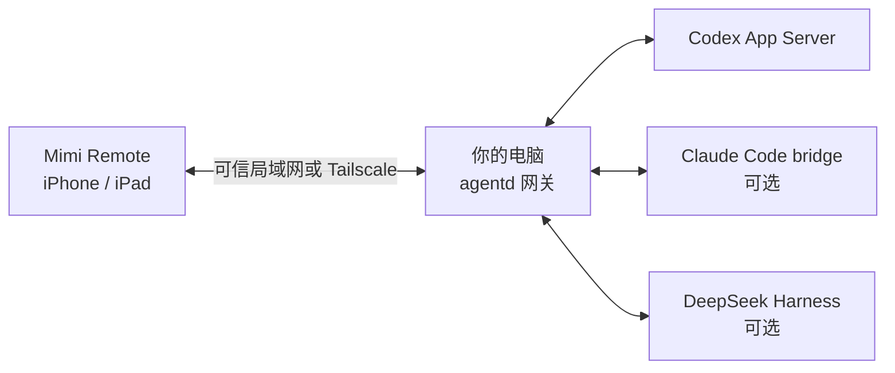

<h1 align="center">Mimi Remote</h1>

<strong>电脑上的 Agent 会话，接着在 iPhone 和 iPad 上用。</strong>

以 Codex 为主、可选接入 Claude Code 和 DeepSeek Harness 的开源移动工作台。

<a href="README.md">English</a> · <a href="https://apps.apple.com/us/app/mimi-remote/id6778076511">App Store</a> · <a href="https://testflight.apple.com/join/jhGPbSk6">TestFlight</a> · <a href="https://github.com/gaixianggeng/mimi-remote/releases/latest">宿主安装包</a>

Agent、项目和会话都留在你的 macOS、Windows 或 Linux 电脑上运行。Mimi Remote 通过可信局域网或 Tailscale 连接这台电脑，让你在手机或平板上接着干活。这是独立第三方项目，与 OpenAI、Anthropic、DeepSeek 和 Tailscale 没有隶属或背书关系。

## 能做什么

- **接着同一段对话：**看实时回复、工具活动和任务状态，继续追问时不用重新交代项目背景。
- **随时控制：**回答问题、处理审批、排队下一条指令，或中断正在运行的任务。
- **把活干完：**使用 Codex 时可以查看改动，并在 App 里使用 Worktree 和 Git 操作。
- **切换电脑：**配对多台宿主，每台使用独立凭据，在「设备」里选择当前连接。会话仍属于各自的电脑。
- **两种屏幕都顺手：**iPhone 是紧凑的会话界面，iPad 是多栏工作台。

 &nbsp;&nbsp;&nbsp; 

截图使用示例数据，不含真实工作区内容或凭据。App 同时支持简体中文和英文。

## 快速开始

你需要一台 **iOS / iPadOS 18+** 的 iPhone 或 iPad，以及一台连接期间保持唤醒的电脑：**macOS 15+**、**Windows 10/11 x64**，或 **Linux**（x86_64 或 ARM64，需要 systemd 用户会话）。

1. 在这台电脑上安装并登录 [Codex CLI](https://learn.chatgpt.com/docs/codex/cli)。
2. 从 [Releases](https://github.com/gaixianggeng/mimi-remote/releases/latest) 安装宿主：Mac 用 `Mimi-Remote-Mac.dmg`，Windows 用 `Mimi-Remote-Setup` 安装程序，Linux 用 `linux` 归档。校验、首次配置、升级和回滚见[安装文档](docs/install-upgrade-rollback.md)。
3. 在已上架地区从 [App Store](https://apps.apple.com/us/app/mimi-remote/id6778076511) 安装 App，或加入 [TestFlight](https://testflight.apple.com/join/jhGPbSk6)，也可以[从源码构建](ios/MimiRemote/README.md)。
4. 打开宿主的配对入口，用 App 扫描二维码。在终端里运行 `agentd pair --qr-only` 也能显示二维码，且不会打印长期访问码。

要添加另一台电脑，在那台电脑上重复以上步骤。想让 Codex 代你安装、升级或排查宿主，可以使用 [install-mimi-remote Skill](packaging/skill/install-mimi-remote)。

## 运行时

| 运行时 | 移动端能力 | 配置 |
| --- | --- | --- |
| **Codex** | 主运行时：会话、实时进度、审批、任务控制和项目工具。 | 安装并登录 Codex CLI。 |
| **Claude Code**（实验） | 会话与审批，控制项少于 Codex；不支持目标、归档和 fork。 | 安装并登录 Claude Code。Mimi Remote Mac 已内置 bridge，检测到 Claude Code 已登录后自动开启；Linux 和 Homebrew 宿主需单独安装 bridge（[Skill 步骤](packaging/skill/install-mimi-remote/SKILL.md)）。 |
| **DeepSeek Harness** | 文本会话与实时进度；不支持附件、Skills、计划、目标和归档。 | 在宿主上运行 Harness，再从 Mimi Remote Mac 连接。执行权限由 Harness 自己管理。 |

技术细节：[Claude bridge](docs/claude-bridge-architecture.md) · [DeepSeek Harness 接入协议](docs/deepseek-harness-protocol.md)。

## 工作原理

```mermaid
flowchart LR
    Mobile["Mimi Remote<br/>iPhone / iPad"] <-->|"可信局域网或 Tailscale"| Host["你的电脑<br/>agentd 网关"]
    Host <--> Codex["Codex App Server"]
    Host <--> Claude["Claude Code bridge<br/>可选"]
    Host <--> DeepSeek["DeepSeek Harness<br/>可选"]
```

电脑上的 `agentd` 负责验证 App 的连接，并转到所选运行时。没有云账号、会话托管或应用层中转。消息通知默认开启，经由一个小型推送服务发送；它只接收 APNs 设备 Token、电脑与会话的匿名短标签、审批类型和过期时间，不接收提示词、代码或会话内容，详见[隐私政策](docs/privacy-policy.md)。`agentd` 只应在私有网络中访问，不要把它的明文 HTTP 端口暴露到公网。

Mimi Remote 是会话客户端，不是远程 Shell，也不在 iOS 上运行 Agent。Codex Desktop 普通「This Mac」模式里的会话不会共享；要在移动端接着用，请按[共享 App Server](docs/shared-ssh-app-server.md) 接入 Desktop。

## 参与开发

仓库包含 SwiftUI iPhone / iPad App、Go `agentd` 宿主、Mac 菜单栏 App、Windows 与 Linux 托盘，以及 Claude bridge。检查与约定见 [CONTRIBUTING.md](CONTRIBUTING.md)，App 构建见 [iOS 构建说明](ios/MimiRemote/README.md)。维护者在正式发布前运行 `bash ./scripts/verify-release.sh`。

Bug 和建议请提交 [GitHub Issue](https://github.com/gaixianggeng/mimi-remote/issues/new)，安全问题按 [SECURITY.md](SECURITY.md) 私下报告，使用帮助见[支持说明](docs/support.md)。

## 许可

Mimi Remote 自有代码与文档采用 [GPLv3，并附商店分发额外许可](LICENSE)。[Claude bridge](bridges/claude/LICENSE) 为 GPLv3-only。第三方许可见 [NOTICE.md](NOTICE.md) 和 [THIRD_PARTY_NOTICES.md](THIRD_PARTY_NOTICES.md)。代码许可不包括 Mimi Remote 名称和图标的使用权，详见[商标政策](TRADEMARKS.md)和[使用条款](docs/terms-of-use.md)。
