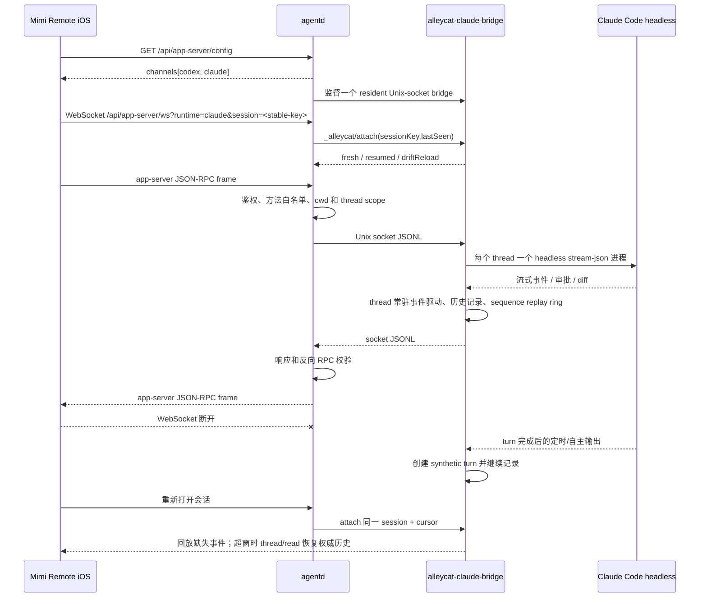

# Claude bridge 架构

更新日期：2026-08-03

## 目标

Claude Code 实验通道让 Mimi Remote 在不复制第二套 iOS 会话 UI、不把 Claude 凭证带到移动端的前提下，复用现有 app-server JSON-RPC 客户端和 `agentd` 安全边界。

bridge 源码位于本仓库 [`bridges/claude`](../bridges/claude)。这里只导入 Mimi Remote 实际需要的 `claude-bridge`、`bridge-core` 和 `codex-proto`，不引入 Alleycat daemon 及其他 coding agent adapter；`agentd` 负责探测、启动、约束和回收 `alleycat-claude-bridge` 子进程。

## 方案

### 组件职责

| 组件 | 职责 | 不负责 |
| --- | --- | --- |
| Mimi Remote iOS | runtime 选择、会话 UI、流式消息、审批交互、本地状态 | 不保存 Claude 登录凭证，不直接启动 Claude CLI |
| `agentd` | Bearer 鉴权、目录授权、方法白名单、版本探测、resident bridge 监督、连接限制和观测 | 不翻译 Claude 私有协议，不托管用户会话到云端 |
| `alleycat-claude-bridge` | app-server JSON-RPC 与 Claude Code headless stdio JSONL 互转；持有 thread runtime、事件回放和运行中交互 | 不监听公网端口，不持有 iOS Token |
| Claude Code | 模型调用、本机登录态、会话和工具执行 | 不直接接受移动端网络连接 |

## 实现

### 生命周期

- 新配置以 `claude.enabled=false`、`claude.activation=auto` 开始。Mimi Remote Mac 启动时依次检查随包 bridge 兼容版本、Claude CLI 和 `claude auth status`；全部通过才自动启用，否则保持关闭且不影响 Codex 主通道。
- `claude.activation` 记录用户意图：`auto` 跟随启动检测，`enabled` / `disabled` 是设置页中的明确选择。明确关闭后不得在后续启动中自动启用；明确开启但前置条件暂时失败时，运行状态仍 fail closed，同时保留偏好，环境恢复后可在下次启动自动恢复。兼容旧配置时，没有 `activation` 的 `enabled=true` 视为用户明确开启。
- 检测到的 Claude CLI 使用本机绝对路径写入 `claude.env.CLAUDE_BRIDGE_CLAUDE_BIN`，避免 LaunchAgent 的精简 `PATH` 导致运行态找不到 CLI；写入过程保留未知字段与配置文件 `0600` 权限。
- 开关变化由 Mac App 重新加载其管理的 LaunchAgent，并等待 Claude Runtime 达到目标状态；失败时恢复修改前的 `activation` / `enabled` 并再次加载服务。
- 启用后，`agentd` 用 `--version` 探测 bridge；低于 `0.2.7`、无标准版本或二进制不存在时 fail closed。`0.2.7` 是首个支持运行期 `thread/list.refreshHistory` 的版本，旧版会静默忽略该字段，不能继续当作兼容实现。
- bridge 与 iOS / Go 代码同仓维护，并随 Mac App 一起构建、签名和安装；`agentd` 优先使用显式配置，否则使用与自身同目录的 `alleycat-claude-bridge`。
- `agentd` 监督一个 resident bridge，通过 Unix socket 为多次 WebSocket 连接复用同一进程。
- iOS 每个 runtime 使用稳定 session key；重新连接携带最后处理的 sequence cursor。bridge session 保存有界 replay ring 和未完成的反向请求。
- 每个 Claude thread 对应一个 Claude Code headless 进程和一个常驻事件驱动器。事件驱动器只跟 thread/process 生命周期绑定，不跟页面、WebSocket 或单个 turn 绑定。
- 客户端 `turn/start` 结束后，Claude 的 cron、`ScheduleWakeup` 或其他自主输出会创建 synthetic turn，继续产生标准 `turn/started → item/* → turn/completed` 事件。
- 普通空闲 Claude 进程默认 10 分钟后可回收；检测到一次性 wakeup 或持久 cron 时保持 active，直到 wakeup 被消费或 cron 被删除。
- 默认最多同时接受 3 条 Claude gateway 连接；Claude 进程池还有独立容量限制，后台任务不会绕过该限制。

### Tool 调用与权限

- iOS 与 `agentd` 之间仍使用结构化 JSON-RPC，不传递无边界 prompt blob 作为控制协议。
- `agentd` 对 Claude 使用比 Codex 更小的独立方法白名单。
- thread、cwd、项目、`browse_roots` 和 managed Worktree 继续使用同一套授权投影。
- 审批反向 RPC 必须与待处理请求匹配；未知反向请求 fail closed。
- Claude channel 只声明 `read-only` 和 `workspace-write` sandbox，不声明移动端 `danger-full-access`。
- 网络默认关闭，不开放 `bypass permissions`，不提供任意 SSH 或 Shell 入口。

### 状态与上下文

- iOS 保存界面状态、轻量会话索引、当前 Mac 档案以及最后处理的事件 cursor；Token 保存在 Keychain。
- `agentd` 维护 gateway 授权状态和每个稳定 session 的转发 cursor；它不是会话历史的权威来源。
- bridge 的 `ConnectionState` 可在 bridge-core 重建 replay session 后重新绑定，避免长期 runtime 把事件写进旧 ring。
- bridge 先从 Claude JSONL 播种完整历史，再追加尚未 flush 的实时 turn；`thread/read` 和 `thread/turns/list` 不会因为本进程出现新 turn 而丢掉旧历史。
- `thread/turns/list` 按 `itemsView` 返回：`summary` 只保留用户与助手文本，工具过程由 `thread/items/list` 按 turn 分页补齐，和 Codex 首屏走同一条路；`full` 或省略时仍带全部 item。裁剪只在请求带 `itemsListAvailable: true` 时生效，这个字段由 agentd 网关写入，表示网关会转发 `thread/items/list`；新 bridge 配旧 agentd 时没有这个字段，bridge 照旧回完整 item。此前 bridge 无视 `itemsView`，一个 18 MB 会话的首页要 400–650 KB，移动端经中继打开明显更慢。
- bridge 的协议输入输出是逐行 JSON；`agentd` 不把整段上下文重新拼成额外提示词。
- Claude Code 登录态和可恢复历史由用户本机 Claude Code 环境管理，不上传到 Mimi Remote 服务器。
- 会话名优先取 Claude 自己写进 transcript 的 `custom-title` / `ai-title`；从 App 新建的会话没有这类记录，由 `agentd` 的自动标题任务（见 `auto-thread-titles.md`）通过 bridge socket 的匿名内部连接调用 `thread/read` / `thread/name/set` 写回，标题文本仍由 Codex 临时线程生成。

### 观测与恢复

- `/api/app-server/config.channels[]` 返回 bridge 路径、版本、健康状态、最低版本和修复命令。
- `agentd doctor` 检查二进制、标准版本和最低兼容版本。
- Gateway 记录有界的连接时长、字节数、策略错误和关闭原因，不记录 Token、prompt 或私有文件内容。
- bridge 非预期退出时返回结构化 `CLAUDE_BRIDGE_EXITED`，不会把半健康连接继续留给客户端。
- 断线不会重新提交 `turn/start`，因此不会为了恢复显示而重复执行写操作；恢复只使用事件 replay 或 `thread/read`。
- Claude Code 新增未知顶层 stdout 事件时按兼容事件忽略并记录，不阻断同批次后续 assistant/result；已知业务事件仍使用强类型解析。

### 成本控制

- 并发进程上限默认 3，避免一台开发机被大量连接拖垮。
- 不建设云端 relay、模型代理或共享账号，因此项目本身不承担 Claude token 成本。
- 客户端只展示 Claude Code headless 实际提供的额度信息；拿不到百分比时明确显示不可用，不抓取 Anthropic 私有网页接口，也不把缺失值伪造成 `0%`。

## 风险与优化

- Claude Code headless 协议和事件字段可能变化，需要 bridge 版本门禁与兼容测试持续跟进。
- replay ring 是有界快速恢复层；超过窗口或 bridge/Mac 重启后，以本机 Claude JSONL 历史为准，运行中但尚未落盘的极短窗口仍可能无法恢复。
- `CronCreate` 属于当前 Claude 进程内任务，会占用一个进程池槽位直到删除；需要在产品层展示后台任务状态，避免用户无感知地长期占用容量。
- 当前不支持 `goal`、`archive`、`fork`，也没有 APNs 后台 push 和跨设备云同步。App 重新打开可以看到结果，不等于系统一定弹出通知。
- 不对断线 turn 做自动重试，避免重复写文件或执行命令；后续优化优先补 run record、客户端确认 cursor 和明确的失败状态。
