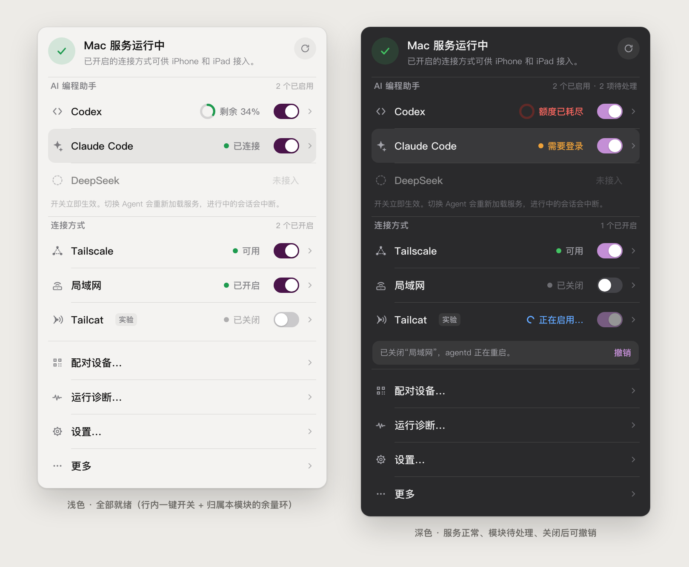
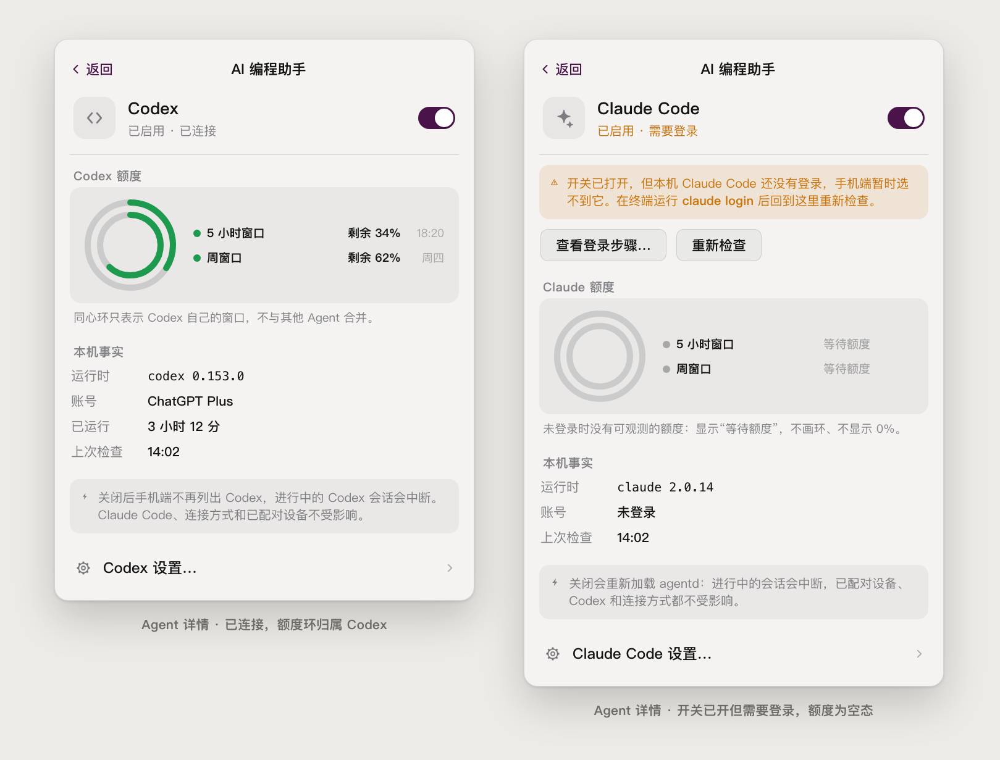
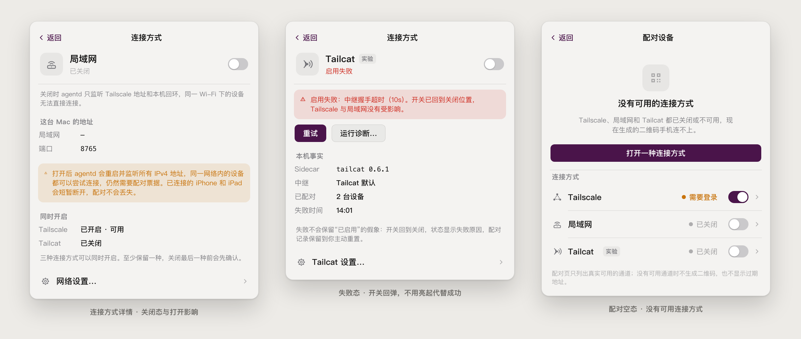
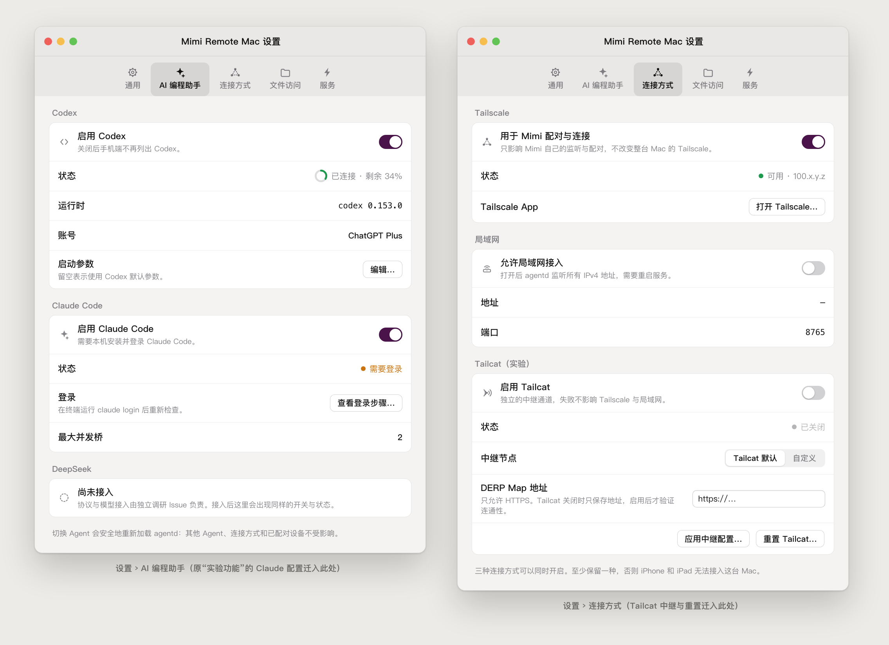
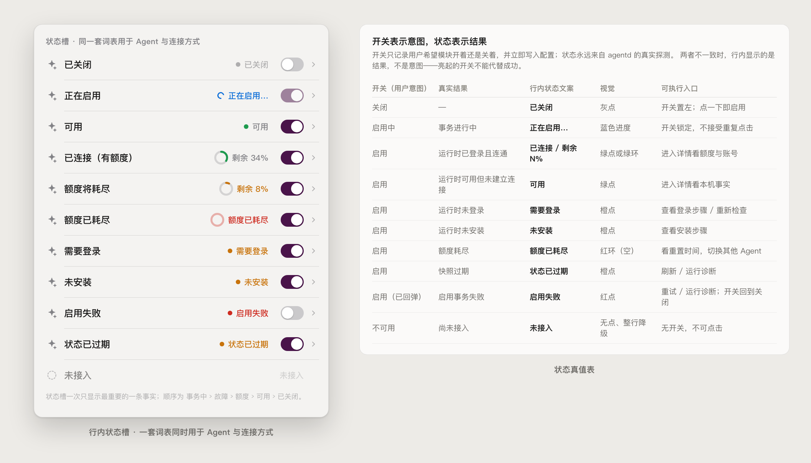

# gh-491 Mac 桌面端「按 Agent 与连接方式管理模块」设计交接

> 本轮只交付信息架构、高保真概念稿、状态契约和实现边界，不修改 Mac 业务代码。
> 概念稿中的版本号、地址、额度、时间都是示例，不代表已实现或已验证的能力。

相关 Issue：[#491](https://github.com/gaixianggeng/mimi-remote/issues/491)

## 1. 目标

把 Mimi Remote Mac 的菜单栏与关联设置，从「服务状态 + 历史分类（Codex 主通道 / 可选实验）」
改成「顶部服务状态 + 两个能力分组 + 每个模块自己的详情」。用户在菜单里要能一眼回答三件事：

1. 这台 Mac 的服务在不在跑；
2. 哪些 AI 编程助手现在真的能用；
3. 哪些连接方式开着，手机能不能连上。

并且能就地开关自己需要的模块。Codex 与 Claude Code 使用同级入口，DeepSeek 预留同一套呈现规则。

## 2. 仓库事实审计

### 2.1 现状（`origin/main`）

| 位置 | 现状 | 问题 |
| --- | --- | --- |
| [MenuBarContentView.swift](../../macos/MimiRemoteMac/Sources/Features/MenuBar/MenuBarContentView.swift) | 状态头 → endpoint/版本/托管方式/项目数 → 「AI 运行时」→ 跨 Agent 三环额度总览 → Codex 行 → Claude 行 → 7 个操作行 | 状态头文案是「Mimi Remote 已连接」，容易被读成手机已连上；开发信息与能力状态混排；额度是跨 Agent 同心环 |
| [ExperimentsView.swift](../../macos/MimiRemoteMac/Sources/Features/Experiments/ExperimentsView.swift) | 一个窗口里同时承载 Claude 开关和 Tailcat 通道配置 | 把「Agent」和「连接方式」两类能力压进同一个「实验功能」分类 |
| [MacSettingsView.swift](../../macos/MimiRemoteMac/Sources/Features/Settings/MacSettingsView.swift) | 单个 `Form`：软件更新 / 启动 / 服务 / 实验功能（仅跳转）/ 文件访问 / 隐私 | 没有按模块归属的配置位置 |
| [PairingView.swift](../../macos/MimiRemoteMac/Sources/Features/Pairing/PairingView.swift) | `PairingNetworkPicker` 固定给出 Tailscale / 局域网 / Tailcat | 可以选到没开启、连不上的通道 |
| [HostStore.swift](../../macos/MimiRemoteMac/Sources/State/HostStore.swift) | 已有 `claudeEnabled`、`canChangeClaude`、`tailcatEnabled`、`isUpdatingClaude/Tailcat`、回滚与重载语义 | 单 writer、确认与重载语义必须保留；没有 Codex 启用态，也没有 Tailscale/局域网的模块级开关状态 |

### 2.2 后端可用语义与缺口

| 能力 | 现在有什么 | 缺什么 |
| --- | --- | --- |
| Claude | `agentd runtime --claude=auto\|enabled\|disabled`，返回 `claude_enabled / available / preference / previous_* / changed / restart_required / reason / message`，支持 `--restore-enabled` 回滚 | 无。这是**本次所有模块开关的范本** |
| Codex | `CodexConfig` 只有 `Bin / DefaultArgs / Env`，没有 `Enabled` | 需要新增启用语义（建议与 Claude 对齐的三态 preference），关闭 Codex 不得影响 Claude |
| 局域网 | `agentd network --lan-enabled=true\|false`，`NetworkConfig.AllowLAN`，返回 `lan_enabled / changed / restart_required` | 无。开关已可用，只是没进模块化界面 |
| Tailscale | `status --json` 的 `network_status.mode` ∈ `lan / tailscale / loopback / specific / unknown`；`internal/tailscaleinfo` 提供节点信息 | 没有「Mimi 内是否使用 Tailscale 通道」的独立意图位（见 §7 决策 A） |
| Tailcat | `agentd tailcat`（启停 / DERP / 重置），`TailcatStatus{enabled,running,version,derp_map_url,paired_device_count,error}` | 无 |
| 运行时状态 | `runtime_status` 返回 `connected / available / signed_out / disabled / unavailable` + `reason`（`not_authenticated`、`bridge_unavailable`、`upstream_unavailable`、`refresh_in_progress`、`quota_refresh_in_progress`…）+ `rate_limits` | 缺「未安装」与「启用事务失败」的稳定区分；`unavailable + reason` 需要在客户端映射（见 §5） |
| 设备连接数 | `AgentStatus` 只有 `projects`，**没有已连接移动设备数** | 顶部文案因此**不能**声称设备已连接或未连接（见 §4.1） |

约束保留：`network.allow_lan` 打开后 agentd 监听 IPv4 通配地址，同时服务 Tailscale 与局域网；
关闭时只监听配置地址与回环。切换 Claude 会安全重载 agentd。

## 3. 设计原则取舍

按 Apple Design 八条原则，本方案的取舍是：

- **Purpose / Simplicity**：顶部只留服务状态，把 endpoint、App/agentd 版本、托管方式、项目数从菜单首层移出
  （endpoint 归到对应连接方式详情，版本与托管方式归到设置 › 服务）。菜单回答「能不能用」，不做仪表盘。
- **Agency + 可撤销**：开关一键生效，不用确认框拦截常规操作；破坏性代价用**撤销**兑现，
  只有「关闭最后一种连接方式」「退出并停止服务」才用确认对话框（`NSAlert`，与现有退出确认一致）。
- **Familiarity**：行内开关 + 详情箭头是 macOS 系统设置里成熟的组合；分组标题、`Form`、
  `Menu`（更多）、`Toggle`、`ProgressView` 全部用系统控件，不自绘。
- **Craft / Responsibility**：开关是意图，状态是结果；两者不一致时行内显示结果。亮起的开关不代表成功。
- **Flexibility / Accessibility**：状态不靠颜色单独承载（点/环 + 文案 + VoiceOver value）；
  Reduce Motion 下换成交叉淡入；深浅色各自定义颜色。

## 4. 信息架构

### 4.1 菜单面板（宽度保持 340pt）



```
状态头       ● Mac 服务运行中                          ⟳
             已开启的连接方式可供 iPhone 和 iPad 接入。
─────────────────────────────────────────────────────
AI 编程助手                                   2 个已启用
  Codex                        ◕ 剩余 34%   [开关] ›
  Claude Code                  ● 已连接     [开关] ›
  DeepSeek                       未接入
  开关立即生效。切换 Agent 会重新加载服务，进行中的会话会中断。
─────────────────────────────────────────────────────
连接方式                                      2 个已开启
  Tailscale                    ● 可用       [开关] ›
  局域网                        ● 已开启     [开关] ›
  Tailcat  实验                 ● 已关闭     [开关] ›
─────────────────────────────────────────────────────
  配对设备…                                          ›
  运行诊断…                                          ›
  设置…                                              ›
  更多                                               ›
```

关键决定：

1. **状态头只描述这台 Mac 的服务**。标题用「Mac 服务运行中」，副标题描述**能力**
   （「已开启的连接方式可供 iPhone 和 iPad 接入」），不写「已连接」，也不写「等待设备连接」——
   仓库没有已连接设备数，两种说法都会撒谎。
2. **模块状态不上升为服务状态**。Claude 需要登录、Codex 额度耗尽时，状态头仍是绿色「运行中」，
   由分组标题右侧的「N 项待处理」承接。菜单栏图标只在**服务本身**降级/停止/失败时加提示点，
   不为「需要登录」长期打点。
3. **DeepSeek 只呈现不可操作**：整行降级 50% 不透明度、无开关、无箭头、不可点击，`help` 提示
   「尚未接入」。真实接入后直接复用同一行结构。
4. **实验标识只属于模块**：Tailcat 名称后跟 `实验` 小徽章，图标用功能语义
   （`antenna.radiowaves.left.and.right`），不再用 `flask` 当分类图标。
5. **低频操作收进「更多」**：`Menu` 内含「检查更新…」「重新启动服务」「关于本机服务」
   「退出并停止服务…」。配对、诊断、设置保留首层。

### 4.2 模块详情（面板内推进，不再开独立窗口）



详情在同一个 340pt 面板内用 `NavigationStack` 推进，返回按钮在左上。结构固定为：

1. **Hero**：模块图标 + 名称（+ 实验徽章）+ 「意图 · 结果」一行 + 开关；
2. **问题条**（仅在需要动作时出现）：一句话说明 + 1–2 个可执行按钮（登录步骤 / 重新检查 / 重试 / 运行诊断）；
3. **额度**（仅 Agent）：该 Agent 自己的同心环 + 逐窗口图例；
4. **本机事实**：运行时版本、账号、已运行、上次检查（连接方式则是地址、端口、中继、已配对数）；
5. **影响说明**：这个开关会造成什么，明确说什么**不受影响**；
6. **「<模块> 设置…」**：跳到设置窗口对应分区，承接需要键盘输入的长表单。

详情里**不放文本输入框**：菜单面板会因点击外部而收起，半截输入必然丢失。
DERP Map 地址、启动参数、并发上限这类输入统一在设置窗口。



### 4.3 额度环（保留，但归属单个模块）

- 环**只**表示同一个 Agent 自己的多个窗口（5 小时 / 周），不再把 Codex 与 Claude 混进一组同心环，
  图例也不再需要「提供方 · 窗口」这种消歧前缀。
- 行内是 18pt 迷你环（线宽 2.6pt），详情里是 74 / 54pt 同心环（线宽 5pt），几何沿用现有
  `MenuRuntimeUsageRingsGraphic`，只把数据源从「跨 Agent slots」换成「单模块 windows」。
- 余量配色阈值：`> 30%` 绿、`10%–30%` 橙、`< 10%` 红、`= 0%` 红色空环 + 「额度已耗尽」。
- **未知额度不画环**：轨道留灰、数值写「等待额度」，不显示 0%，不显示空心 100%。
- 额度只在**已启用且已连接**时出现在行内状态槽；未登录、未安装、已关闭时行内显示状态文案。

### 4.4 设置窗口（替代「实验功能」窗口）



`Settings` 改为 `TabView`：**通用 / AI 编程助手 / 连接方式 / 文件访问 / 服务**。

- 通用：软件更新、登录时启动、隐私说明；
- AI 编程助手：Codex（启用、状态、运行时、账号、启动参数）、Claude Code（启用、状态、登录、最大并发桥）、
  DeepSeek（未接入说明）；
- 连接方式：Tailscale（Mimi 内启用、状态与地址、打开 Tailscale）、局域网（允许接入、地址、端口）、
  Tailcat（启用、状态、中继节点分段控件、DERP Map 输入、应用中继配置、重置）；
- 文件访问：现有照片与完全磁盘访问分组原样搬入；
- 服务：当前状态、运行方式、agentd 版本、恢复 Homebrew。

`ExperimentsView` 与 `ExperimentMenuRouting` 随之删除：Claude 去「AI 编程助手」，
Tailcat 去「连接方式」，菜单不再有「实验功能…」入口。

### 4.5 配对入口

- `PairingNetworkPicker` 只列出**已启用且状态可用**的通道；不可用通道不置灰保留，直接不出现。
- 一个可用通道时不显示选择器，直接出二维码。
- 零可用通道时：菜单「配对设备…」保持可点（不做成灰行让人猜原因），进入后是空态——
  标题「没有可用的连接方式」、一句原因、主按钮「打开一种连接方式」、下面直接嵌入连接方式三行（带开关），
  开完当场返回二维码。**不生成连不上的二维码，也不展示过期地址。**

## 5. 状态契约



### 5.1 状态槽优先级

行内只有一个状态槽，按优先级取**一条**：
**事务中 › 故障 › 额度 › 可用 › 已关闭**。

| 状态 | 文案 | 视觉 | 来源 |
| --- | --- | --- | --- |
| 关闭 | 已关闭 / 已开启（连接方式） | 灰点 | 本地意图 + 配置 |
| 事务中 | 正在启用… / 正在关闭… | 蓝色 `ProgressView` | `isUpdating*` |
| 已连接（有额度） | 剩余 N% | 迷你余量环 | `state=connected` + `rate_limits` |
| 已连接（无额度数据） | 已连接 | 绿点 | `state=connected` |
| 可用 | 可用 | 绿点 | `state=available` |
| 需要登录 | 需要登录 | 橙点 | `signed_out`，或 `unavailable + reason=not_authenticated` |
| 未安装 | 未安装 | 橙点 | `unavailable + reason∈{bridge_unavailable, 未找到可执行文件}` |
| 额度耗尽 | 额度已耗尽 | 红色空环 | `rate_limits.isExhausted` |
| 状态已过期 | 状态已过期 | 橙点 | 快照 `isExpired()` 且非刷新中（沿用现有 stale-while-revalidate） |
| 启用失败 | 启用失败 | 红点 + 开关回弹 | 启用事务抛错 |
| 未接入 | 未接入 | 无点、整行降级 | 客户端常量（DeepSeek） |

「未安装」需要 agentd 在探测不到可执行文件时给出稳定 `reason`；在该字段落地前，客户端把
未识别的 `unavailable` 统一显示为「暂不可用」并给「运行诊断…」，**不猜**成未安装。

### 5.2 开关事务

1. **按下即响应**：开关立刻动到新位置，状态槽换成「正在启用…」，该行开关禁用直到事务结束。
2. **意图持久化**：写入配置（Claude 已有 `preference`，Codex 需新增同形状字段），重启后按意图恢复；
   `auto` 只作为「用户从未表态」的初始值，用户拨动过就是显式 `enabled` / `disabled`。
3. **成功**：状态槽换成真实结果。**结果不等于成功**——开关开着、状态显示「需要登录」是合法终态。
4. **失败**：开关回弹到原位置，状态槽显示「启用失败」，详情里给失败原因 + 「重试」「运行诊断…」。
   沿用 `--restore-enabled` 的回滚路径，不留「亮着但不工作」的开关。
5. **可撤销**：关闭类操作在面板底部显示一条撤销条（约 6s，可用 Tab 聚焦、回车触发）：
   「已关闭"局域网"，agentd 正在重启。｜撤销」。撤销即反向执行同一事务。
6. **确认只用于两处**：关闭**最后一种**连接方式（会让手机彻底连不上这台 Mac）、退出并停止服务。
   其余一律「立即生效 + 可撤销」。
7. **串行**：沿用 HostStore 单 writer；有事务在飞时其他模块开关置灰，避免并发改配置。

### 5.3 影响说明（每个模块固定一句）

| 模块 | 关闭/打开的影响 | 明确不受影响 |
| --- | --- | --- |
| Codex | 手机端不再列出 Codex；进行中的 Codex 会话中断 | Claude Code、连接方式、已配对设备 |
| Claude Code | 重新加载 agentd；进行中的会话中断 | 已配对设备、Codex、连接方式 |
| Tailscale（Mimi 内） | 不再用 Tailscale 地址配对与展示 | 整台 Mac 的 Tailscale、其他 App |
| 局域网 | agentd 重启并监听所有 IPv4；已连接设备短暂断开 | 配对记录、Tailscale、Tailcat |
| Tailcat | 启停 sidecar | Tailscale、局域网、当前 agentd 会话 |

## 6. 高保真规格

| 项 | 值 |
| --- | --- |
| 面板宽度 / 内边距 | 340pt；水平 12pt，顶部 12pt，底部 6pt（沿用 `MenuBarLayout`） |
| 图标列 / 图标–文字间距 | 16pt / 8pt；分组标题与行都对齐 `sectionInset = 3pt` |
| 模块行 / 操作行高 | 均 40pt，悬停底色圆角 8pt；分隔线左缩进 27pt（= 3 + 16 + 8） |
| 字号 | 标题 13pt semibold；行名 12pt medium；状态 10.5pt medium；分组标题 10pt bold；脚注 9pt |
| 开关 | 系统 `Toggle` + `.toggleStyle(.switch)`、`controlSize(.mini)`；概念稿按约 30×18pt 绘制，实现以系统实际尺寸为准，与箭头间距 7pt |
| 状态点 / 迷你环 | 6pt 圆点；18pt 环、线宽 2.6pt |
| 详情同心环 | 外 74pt、内 54pt，线宽 5pt，轨道 `secondary 18%` |
| 状态色（浅/深） | 绿 `#1D9A4E` / `#43C463`；橙 `#C8730B` / `#F0A33A`；红 `#CE2B20` / `#FF6961`；蓝 `#0A6DD8` / `#63A8FF` |
| 品牌色 | `Color.mimiPrimary` 只用于开关开启态与主按钮，**不用于状态语义** |
| 动效 | 推进/返回与高度变化 `spring(response: 0.35, dampingFraction: 1)`；按下 `0.985` 缩放；环变化 `spring(0.35, 1)` |
| Reduce Motion | 推进换 0.18s 交叉淡入，环直接跳值，撤销条不滑入 |

预估面板高度：状态头 46 + 分组 A（20 + 3×40 + 脚注 18）+ 分组 B（20 + 3×40）+ 操作 4×40 + 分隔与留白 ≈ 500pt，
比现状（含跨 Agent 环卡片）不增高。需要在 1440×900 与「菜单栏自动隐藏」下回归不溢出。

## 7. 需要确认的决策

**A. Tailscale 开关在 Mimi 内的边界。** 现在 `allow_lan=true` 就是 IPv4 通配监听，
Tailscale 地址同样可达，socket 层做不到「关 Tailscale、留局域网」。本方案把开关定义为
**「是否把 Tailscale 作为 Mimi 的配对与展示通道」**，并在详情里如实写明监听范围，
不声称已阻断该地址；要真正按接口绑定需要 agentd 侧新增能力，超出本 Issue 边界。
若要求「开关即真实阻断」，需要先立一张 agentd 监听改造的 Issue。

**B. 一键开关 vs 先确认。** 本方案按用户要求做成行内一键，靠**撤销**而不是确认框兑现安全，
仅对「关闭最后一种连接方式」和「退出并停止服务」保留确认。
如果 agentd 能上报**进行中会话数**，建议加一条：有活跃会话时，关闭 Agent 才升级为确认框
（文案带上会话数）——这需要 status 新增字段。

**C. Codex 启用语义的落点。** 建议 `CodexConfig` 新增 `Enabled` + `Preference`（与 Claude 同形状），
并新增 `agentd runtime --codex=auto|enabled|disabled`，复用 `restart_required` 与 `--restore-enabled`。
关闭 Codex 必须只影响 Codex：`internal/httpapi/runtime_status.go` 里 Codex 分支需要与 Claude 的
`disabled` 分支对称，返回 `state=disabled, reason=disabled`。

## 8. 实现边界

范围内：菜单面板重构、模块详情、设置窗口分区化、配对通道筛选与空态、
为「独立控制」所必需的 agentd 改动（Codex 启用语义、`未安装` reason、可选的活跃会话数）。

范围外：通用插件框架或模块市场；Windows/Linux 托盘同步改造（`cmd/mimi-remote-tray` 本次不动）；
移动端改版；DeepSeek Runtime 的协议与接入；跨 Mac 多主机管理。

沿用：SwiftUI、现有 `HostStore` 状态所有权与单 writer、`AgentCommandClient` 命令链路、
`MenuBarWindowPlacement` 与激活守卫、现有 `NSAlert` 确认风格。

## 9. 验收映射

| Issue 验收标准 | 本设计的兑现方式 |
| --- | --- |
| Codex 与 Claude 同级，实验功能不再统一分类 | §4.1 两分组；§4.4 删除 `ExperimentsView`，实验徽章只挂 Tailcat |
| 单独管理 Agent 启用状态 | §5.2 + §7 决策 C（Codex 启用语义与对称的 `disabled` 状态） |
| 三种连接方式的独立控制边界 | §5.3 影响表 + §7 决策 A（明确不动整台 Mac 的 Tailscale） |
| 意图持久化、重启恢复、四类状态有入口 | §5.1 状态槽、§5.2 事务、详情问题条的可执行按钮 |
| 切换前明确影响、保留回滚 | §5.2 撤销 + 失败回弹；§5.3 每模块一句影响说明 |
| 配对只提供可用方式、空态不误导 | §4.5 |
| 状态/额度/设置归属模块，未知额度不显示 0% | §4.3、§4.4 |
| DeepSeek 无可操作开关 | §4.1 第 3 条 |
| 最小闭环与回归 | 实现阶段按「启用 Agent → 开启连接 → 配对 → 手机使用」，外加关闭、失败、重启恢复三条回归 |
| 深浅色、键盘/辅助功能、内容不溢出 | §6 颜色与动效表、状态不靠颜色单独承载、面板高度预估 |

## 10. 下一步

1. 按 §7 确认 A / B / C 三个决策；
2. 先落 agentd 语义（Codex 启用、`未安装` reason），再改 UI，避免界面先行、开关没有真实后端；
3. UI 实现顺序：状态槽与模块行组件 → 菜单面板分组 → 模块详情 → 设置分区化 → 配对筛选与空态；
4. 概念稿与实现对齐后，把真实截图补进本目录，替换示例图。
