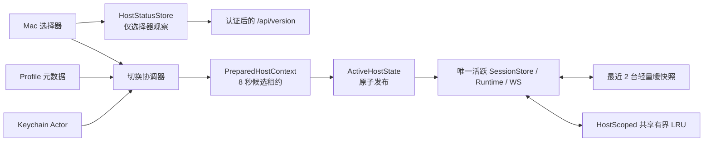

# 多 Mac 单活切换实现与发布门禁

更新日期：2026-07-28

## 目标

Mimi Remote 支持保存多台 Mac，但任一时刻只激活一台。移动端通过原生菜单切换当前 Mac，不并排展示多主机会话，也不在后台维护其他 Mac 的 Runtime、业务 WebSocket、轮询或业务数据。

本实现优先守住三条边界：

- 数据身份使用稳定 `profileID`，网络地址只作为可修改路由。
- 切换采用“候选连接验证成功后原子提交”，失败时旧 Mac 页面和连接不变。
- 非当前 Mac 只在用户打开选择器后做轻量状态探测，不进入工作台观察链。

## 方案

### 身份和数据隔离

- `agentd` 首次启动生成随机 UUID v4，原子写入配置目录的 `installation-id`，权限固定为 `0600`。
- 已存在的身份文件若权限、类型或格式异常，`agentd` 拒绝启动；不会静默换身份。
- 认证后的 `GET /api/version` 从内存返回 `installation_id` 和服务端 `platform`（`darwin` / `windows` / `linux`），请求过程不读磁盘、不启动子进程、不连接 upstream。
- 同一响应里的 `device_name` 是宿主电脑名（macOS 取系统「电脑名称」，其他平台取主机名）；它只作为未自定义名字连接的默认显示名，不参与身份判断。该字段在进程启动时预热、过期后后台刷新，请求路径同样不读磁盘、不启动子进程。
- `HostScope` 由 `profileID + installationID + generation` 组成；异步结果回写前必须验证完整租约。
- Session、Project、Message、Log、Context、Draft、分页、通知、Markdown Render、图片和本地路径缓存均按 Profile 隔离。
- endpoint 旧数据只在唯一 Profile 匹配时复制一次；同地址存在歧义时不迁移。

相同 `installation_id` 更换 endpoint 会更新原 Profile；已有 Profile 返回不同身份时拒绝切换；重复添加同一安装身份时引导用户更新已有 Mac。

### 快速激活

顶部菜单只执行以下快速路径：

1. 点击后立即进入切换态，保留旧页面并禁用写操作。
2. 从 Keychain Actor 读取目标 Token。
3. 并行请求目标 Mac 的 `/api/version` 和 `/api/app-server/config`。
4. 校验身份后执行一次 gateway connect + initialize。
5. 生成最长存活 8 秒、单次消费的 `PreparedHostContext`，不 resume thread、不加载业务数据。
6. 候选验证或 Keychain 提交失败时立即关闭候选连接，旧 Runtime 不变。
7. 成功后捕获旧主机轻量快照，原子提交 `ActiveHostState`，退役旧 Runtime，并把候选连接交给新 Runtime。
8. 先显示暖快照或 skeleton，再加载 20 条会话索引和当前会话首屏文字；Git、模型、能力、额度和媒体延后。

只有幂等的传输错误可在总计 8 秒内重试一次。缺 Token、401、403 和身份变化不重试。切换期间最多短暂存在旧 active 与新 candidate 两条连接；候选取消会直接中断底层 connect 并释放资源。

### 缓存、媒体和通知

- 最近 2 个 Profile 各保留最多 1 MiB 的内存暖快照，不包含完整历史、图片、日志、Task 或连接。
- Conversation、Render、Image 和 Log 继续共用全局预算，key 增加 `profileID`，不会按 Mac 成倍扩容。
- `MediaWorker actor` 负责 Base64 解码、图片降采样和临时文件写入；主线程只接收最终状态。
- Timeline 视图身份和媒体任务身份包含 Profile；切走后旧任务即使结束也不能写入新主机。
- 非当前 Mac 不订阅审批、不轮询阻塞任务、不发 APNs。切换后从权威状态补齐待审批和待补充信息。
- 审批通知保留；完成和失败通知默认关闭；手动提醒与运行通知 ID 均包含 Profile。

### 主机状态探测

`HostStatusStore` 不注入工作台和 Timeline 的观察链。菜单关闭、冷启动关键路径、离线、后台和显式切换期间均不探测非当前主机。

菜单打开后：

- 先展示缓存，再仅对过期 Profile 请求认证后的 `/api/version`。
- iOS 将 `platform` 归一化并缓存到 Profile；多设备入口据此展示 Apple、Windows 11 或 Linux 图标，旧服务端和未知平台继续展示通用电脑图标。
- 使用共享 ephemeral `URLSession`，关闭 Cookie 与 URLCache。
- 全局并发最多 2，每轮最多 8 台，单请求 2 秒且不自动重试。
- 成功至少缓存 60 秒；失败按 15、30、60、120、300 秒加约 20% jitter 退避。
- 同一 Profile 的并发触发合并为 single-flight。
- 缺 Token、401/403 和身份变化在 Profile 修改前保持终态。

## 实现

主要代码入口：

- 后端身份：`internal/config/installation_identity.go`
- 后端版本接口：`internal/httpapi/router.go`
- Profile V2、Keychain Actor、候选上下文：`ios/MimiRemote/Sources/State/AppStore.swift`
- HostScope 与切换资源：`ios/MimiRemote/Sources/State/HostScope.swift`、`HostConnectionSupport.swift`
- 原子切换和旧任务租约：`ios/MimiRemote/Sources/State/SessionStoreConnection.swift`
- 轻量状态探测：`ios/MimiRemote/Sources/State/HostStatusStore.swift`
- 暖快照：`ios/MimiRemote/Sources/State/HostWarmSnapshot.swift`
- 媒体后台处理：`ios/MimiRemote/Sources/Core/Media/MediaWorker.swift`
- 原生切换入口：`ios/MimiRemote/Sources/Features/Shell/HostSwitcherMenu.swift`

测试覆盖稳定身份文件、V1 绑定、重复身份、身份漂移、Keychain 回滚、候选取消、旧异步结果丢弃、同 ID/同路径隔离、共享 LRU、唯一迁移、暖快照上限和状态探测退避。

## 性能发布门禁

代码已埋入以下不含 endpoint、Token 和正文的 signpost：

`host_switch_tap`、`switch_prepare`、`gateway_initialized`、`host_commit`、`warm_snapshot_visible`、`session_index_visible`、`first_text_visible`、`first_media_request`、`first_media_decoded`。

发布前必须在同一台 Release 真机、同一网络分别测试基线 commit 与本分支，模拟器结果不能代替性能结论。

| 指标 | 门槛 |
| --- | --- |
| 保存 5 台 Mac 的冷启动 | 首屏前非当前主机 REST/WS 为 0；当前主机请求数量和顺序不增加 |
| 冷启动 P95 TTI | 相对基线回退不超过 5% 或 100ms，取较宽者 |
| 菜单打开与点击反馈 P95 | 不超过 100ms，不能等待网络 |
| 验证成功到缓存/skeleton 首帧 | 不超过 150ms |
| 热切换到 session/text P95 | 不超过 300ms |
| History 响应到首批文字 Row P95 | 不超过 200ms |
| 图片可见前 | 对应 media 请求必须为 0 |
| 主线程 | 切换、历史和图片场景中超过 100ms stall 为 0 |
| 滚动 | Hitch ratio 不超过 1%，相对基线劣化不超过 5% |
| 内存 | 5 台轮转后趋于平台，峰值 RSS 不超过基线 +15% |
| 连接 | 稳态仅当前 Mac 保持业务连接；每个可用 Runtime provider 最多 1 条共享 WebSocket |
| 100 次 A↔B | 0 crash、0 串数据，Task/连接数回归基线，内存不持续增长 |

建议用 Instruments 的 Points of Interest、SwiftUI、Time Profiler 和 Allocations 同时留证。没有通过真机门禁时，不把快速切换列为可发布能力。

## 风险与优化

- `installation-id` 是设备数据身份的一部分，备份或迁移配置时必须与该 Mac 的 Profile 关系一起处理，不能手工复制到另一台 Mac。
- 切换前已被旧 Mac 接收的 Turn 会继续运行；发送结果不确定的本地队列会标为 `needsConfirmation`，切回后由用户确认，禁止自动重发。
- 当前 Mac 可同时保留 Codex、Claude 各 1 条共享连接。前台会话与后台排队会话可能属于不同 provider，
  不能为了压缩成单条连接而互相退役；切换 Mac、进入后台或凭据失效时必须整体关闭当前
  `AppServerRuntimeBundle`。发布 soak test 应验证稳态连接数不超过当前可用 provider 数。
- 真机性能、慢 DNS/DERP 和 100 次轮转属于发布验证，不应以单测或模拟器通过替代。
- 首版不实现多主机并排、后台业务预热、非当前主机实时通知、中心云、APNs 中转、iCloud 凭据同步或自动故障转移。
