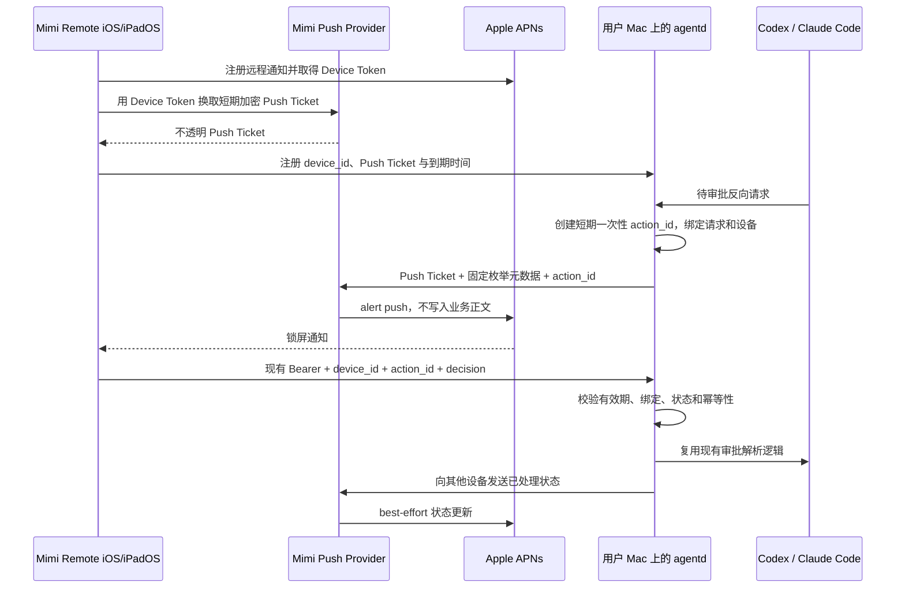

# 锁屏审批通知最小架构

更新日期：2026-08-20
状态：已确认，进入实现。

已确认的两条产品决策：

1. 接受由维护者运营一个只转发固定格式审批提醒的最小 APNs Provider。
2. 锁屏审批提醒是**默认关闭的实验性功能**。只有用户在 App 内显式同意使用该中转服务后才注册 Device Token 并发送提醒；坚持纯本地部署的用户不开启即可，链路上不产生任何对外请求。

## 目标

让 Mimi Remote 在 iPhone 或 iPad 锁屏、App 位于后台或进程未运行时，仍能收到 Codex / Claude Code 待审批提醒，并从系统通知完成单次允许、拒绝或进入详情。

最小闭环只负责审批通知，不增加云账号、会话托管、代码中继、模型代理或通用消息推送。现有前台 WebSocket 与私有网络审批链路必须在 APNs 故障时继续工作。

## 方案

### 已确认的产品边界

APNs 要求 Provider 通过 Apple 签发的私钥或证书向 APNs 发起请求。该凭据属于 Mimi Remote 的开发者团队，不能放进 iOS App、`agentd`、公开仓库或 Release 资产。因此：

- 要满足“App 已挂起或未运行时收到锁屏通知”，必须存在维护者可控、持有 APNs Provider 凭据的公网服务。
- 让每个用户自行部署 Provider 只有在用户自行更换 Bundle ID、签名并持有自己的 Apple Developer 凭据时才成立，不适合作为 App Store 版本的日常路径。
- 如果继续坚持“维护者不运营任何中转服务”，本 Issue 只能保留当前 App 在线时的本地通知，无法满足远程锁屏通知验收标准。

结论：接受一个只转发固定格式审批提醒的最小 Provider。它不接收提示词、代码、完整命令、文件内容、会话历史或 `agentd` 访问 Token；审批动作仍由设备通过现有私有网络直接提交给用户自己的 `agentd`。

### 用户同意与功能开关

中转服务是可选项，不是默认链路。约束如下：

- 功能位于 App 的高级 / 实验功能区，默认关闭。关闭状态下 App 不请求远程通知授权、不注册 Device Token、不向 Provider 发送任何请求。
- 首次开启必须展示明确的同意说明：会离开设备的是什么（APNs Device Token、匿名主机与会话标签、审批类型枚举、到期时间）、不会离开设备的是什么（Prompt、源码、完整命令、文件内容、会话历史、`agentd` 访问 Token）、以及数据保留策略。未同意即不开启。
- 关闭开关等价于撤销：App 注销 Device Token，`agentd` 删除本地 Ticket 并请求 Provider 把 Ticket ID 加入撤销表。
- `agentd` 侧同样默认关闭（`push.enabled`）。Provider 未配置或用户未同意时，代码路径必须与今天完全一致，升级不产生任何静默上传。
- 纯本地部署因此仍然成立：不开启该实验功能的用户，其审批链路依旧只经过自己的私有网络。

### 现状基础与第二个前置条件

仓库已经具备一部分可复用能力：

- iOS 在收到 `.approvalRequest` / `.userInputRequest` 后会安排本地通知，通知路由只含 profile、project 与 session 标识；现有 Bearer Token 使用 `kSecAttrAccessibleAfterFirstUnlockThisDeviceOnly` 保存在 Keychain。
- raw Codex gateway 已维护反向请求 allowlist、同 ID 响应、权限响应安全重写、一次消费和过期清理。
- Claude resident bridge 已支持断线后的 `serverRequest/replay` 与 resolved 清理。

但生产环境的 raw Codex 路径仍是 iOS WebSocket 与上游 app-server WebSocket 一对一代理。App 进入后台时会主动退役 WebSocket，`agentd` 随之失去接收后续反向审批请求的连接。仓库中旧的 `CodexAppServerRuntime` 内存审批 broker 没有注入生产 Router，不能误当成现成后台链路。

因此只增加 APNs 调用仍然不够。实现必须先让 `agentd` 在活跃 turn 期间拥有一个有界的 Codex approval broker：iOS 断开后继续读取原上游连接，只保留待审批反向请求、必要 resolution tombstone 和有界恢复元数据；iOS 重连时恢复同一连接或走权威历史对账，并重放仍有效的 server request。它不持久化 Prompt、输出或完整会话，`agentd` 重启后继续 fail closed。Claude 路径复用现有 resident bridge，不复制第二套完整 runtime。

### 数据流



### 组件职责

| 组件 | 负责 | 不负责 |
| --- | --- | --- |
| Mimi Remote | 通知授权、Device Token 刷新、动作类别、系统解锁保护、直接调用 `agentd`、通知清理 | 不持有 APNs Provider 私钥，不在 Payload 中放长期凭据 |
| `agentd` | 多设备映射、审批事件识别、一次性动作状态机、幂等校验、调用 Provider、继续提供前台审批 | 不把会话、源码或完整命令上传到 Provider |
| Mimi Push Provider | 校验固定请求、解密 Push Ticket、生成 APNs 请求、最小观测、密钥轮换 | 不托管账号、会话、代码，不代理审批动作 |
| APNs | 系统级投递、通知分组与动作入口 | 不承诺固定投递延迟，不作为审批状态权威来源 |

### Push Ticket

Provider 不长期保存 APNs Device Token。iOS 把新 Token 提交给注册接口后，Provider 返回一个经过认证加密的不透明 Push Ticket，内部只包含：

- 协议版本、Ticket ID 与密钥版本；
- APNs 环境、Topic 和 Device Token；
- 随机设备安装标识的摘要；
- 签发时间与到期时间。

`agentd` 只保存 Ticket、`device_id`、到期时间和最近刷新时间，看不到其中的 APNs Token。Ticket 建议 30 天到期，App 每次前台启动时在剩余 7 天以内刷新。刷新或忘记连接时，`agentd` 删除旧 Ticket，并请求 Provider 将旧 Ticket ID 加入只保留到原到期日的撤销表。

Provider 的持久数据因此可以限制为“已撤销 Ticket ID + 到期时间”。遗失 Ticket 最多只能向绑定的单台设备发送固定格式的 Mimi 通知，不能访问 `agentd`，也不能直接批准请求；仍需按 Ticket 和来源限速。

### APNs Payload

Provider 只接受固定 Schema，不接受调用方传入任意标题、正文或 APNs 字典。建议字段如下：

```json
{
  "version": 1,
  "event": "approval.pending",
  "action_id": "128-bit-random-opaque-id",
  "device_id": "random-installation-id",
  "profile_id": "local-random-profile-id",
  "host_tag": "A1C3",
  "session_tag": "7D92",
  "approval_kind": "command",
  "expires_at": "2026-08-09T06:15:00Z"
}
```

Provider 根据枚举生成本地化 APNs Payload：

- `apns-push-type: alert`；
- `apns-topic` 固定为 Mimi Remote Bundle ID；
- `apns-expiration` 不晚于审批到期时间；
- `apns-collapse-id` 使用单个审批请求的稳定标识，避免重复投递产生多张卡片；
- `aps.category` 固定为审批类别；
- `aps.thread-id` 使用会话匿名标签，按会话归组；
- 标题和正文使用 App 包内本地化 key，只显示匿名主机标签、会话标签和审批类型。

不得放入访问 Token、工作目录、项目名、源码、Prompt、完整命令、文件内容、Diff、模型输出、长期凭据或可反查用户身份的名称。

### 通知动作

- “允许一次”：`UNNotificationAction` 使用 `authenticationRequired`，系统必须先解锁设备。
- “拒绝”：建议同时使用 `authenticationRequired` 与 `destructive`，避免未授权的人仅凭锁屏访问就中断任务。
- “查看详情”：使用通知默认点击进入 App 并路由到对应会话。

Apple 在通知界面空间有限时最多展示两个自定义动作，因此“查看详情”不应占用第三个自定义按钮；两个按钮用于允许和拒绝，点击通知本身完成查看详情。

动作回调只携带严格解析后的路由与 `action_id`。App 用现有 Keychain Bearer Token 直接调用目标 `agentd`，等待网络结果或短超时后再结束系统回调；网络不可达时不猜测结果，提示用户打开详情重试。

### 一次性动作状态机

`agentd` 为每个待审批请求生成至少 128 bit 随机 `action_id`，只在本机保存，并绑定：

- runtime、session ID、原始 approval ID；
- 允许响应的 `device_id` 集合；
- 签发与到期时间；
- `pending / executing / approved / rejected / expired / revoked` 状态；
- 已提交 decision 的幂等结果。

处理决策时必须原子完成校验和状态迁移：

- 首次合法决策进入 `executing`，然后复用现有运行时审批解析；
- 同设备、同 decision 重放返回已完成结果，不再次调用 runtime；
- 冲突 decision 返回 `409`；过期、撤销或会话结束返回 `410`；未知句柄返回 `404`；
- 前台已经处理、runtime 超时或会话结束时立即撤销所有相关 action ID；
- `agentd` 重启后不恢复旧审批动作，现有 runtime 请求继续 fail closed。

短期 `action_id` 本身不足以执行审批：请求还必须通过现有 Bearer 鉴权、目标私有网络可达性和设备绑定校验。

### 状态更新与通知清理

`agentd` 是审批状态的唯一权威来源。某台设备处理完成后：

1. 原子落定本地 action 状态并响应设备；
2. 向其余注册设备发送 `approval.resolved`；
3. iOS 收到动作结果或后台状态更新后删除对应 delivered notification；
4. App 下次前台恢复时重新读取待审批状态，清理所有已完成、撤销或过期通知。

远程清理是 best-effort；APNs 可能延迟或合并投递，因此旧通知仍可能短暂存在。任何旧通知再次操作时都由 `agentd` 返回已经处理或过期，不能二次生效。

## 实现

### 仓库改造边界

建议按一个 Issue 内的四个可单独测试阶段推进：

1. `agentd` approval broker：让 raw Codex 的活跃上游连接在 iOS 退到后台后有界存活，复用 gateway allowlist、response mapper、permissions 重写与 Claude replay 语义；不把旧 `CodexAppServerRuntime` 直接接回生产。
2. `agentd` 安全动作层：增加设备注册、动作句柄状态机、Provider client 与审批生命周期挂钩；默认关闭，Provider 未配置时完全不影响现有行为。
3. iOS / iPadOS：增加 Push Notifications capability、AppDelegate Device Token 回调、通知类别、后台动作处理和设置状态；复用现有通知路由与 Keychain Token。
4. Provider：新增最小 Go 服务和 Docker 部署，只有 Ticket 注册/刷新/撤销与固定审批通知接口；不与 `agentd` 共用 APNs 私钥。

主要插入点以当前生产路径为准：

- `internal/httpapi/appserver_gateway_threads.go`：反向请求登记、replay、resolved 与 terminal 清理；
- `internal/httpapi/appserver_gateway_policy.go`：同 ID response 与 permissions 安全重写；
- `internal/httpapi/appserver_gateway_websocket.go`：当前一对一代理生命周期，需要收敛为可短期 detach / reattach 的本机 broker；
- `ios/MimiRemote/Sources/State/SessionStoreConnection.swift`：现有审批本地通知投影；
- `ios/MimiRemote/Sources/MimiRemoteApp.swift`：通知 delegate、冷启动路由与后续 action 分流；
- `ios/MimiRemote/Sources/Core/API/CodexAppServerTransport.swift`：现有 Allow / Deny JSON-RPC response，可作为动作最终落点。

功能门禁建议使用 `capabilities.disabled` 与独立 `push.enabled` 配置双重控制。默认配置不开启 Provider，避免升级后无意上传 Device Token。

### Provider 部署与密钥

MVP 使用单个小型 Go 服务即可，前面放托管 TLS；撤销表可以使用单实例持久卷上的 SQLite。若需要多实例或无服务器部署，再换成托管 KV，不提前引入队列、Kafka 或完整账号数据库。

秘密只通过部署平台的 Secret Store 或主机权限为 `0600` 的外部文件注入：

- APNs `.p8` Provider key、Key ID、Team ID；
- 当前和上一版 Push Ticket 加密密钥；
- 必要的运维访问凭据。

轮换顺序为“创建并部署新 key → 观察成功投递 → 切换签发 → 等旧 Ticket 窗口结束 → 撤销旧 key”。APNs Provider Token 按 Apple 要求定期重建，进程内缓存时间不得超过其有效窗口。

### 观测与保留

Provider 只记录：请求计数、延迟、限速、APNs HTTP 状态/原因、匿名 Ticket ID 摘要和密钥版本。禁止记录 Authorization、Push Ticket、Device Token、`action_id`、完整请求体或 APNs Payload。

建议保留策略：

- 撤销 Ticket ID：仅保留到 Ticket 原到期日，最长 30 天；
- 无 Payload 的结构化错误日志：7 天；
- 聚合成功率与延迟指标：30 天；
- APNs Device Token：不落库，只在注册和投递请求的进程内短暂处理。

至少告警：APNs 认证失败、Topic/环境不匹配、`410 Unregistered` 激增、Provider 5xx、投递延迟和撤销表不可写。

### 成本

低量 MVP 的计算与存储需求很小：一个小型 Go 容器、TLS、少量 SQLite/KV 和指标即可。实际现金成本取决于是否复用现有 Linux 主机；主要长期成本不是 CPU，而是公网可用性、系统补丁、APNs 密钥轮换、告警和值守。若没有现有主机，托管容器加托管 KV 可降低运维，但会增加平台依赖。

### 故障降级

- Provider 或 APNs 不可用：记录有界错误，不阻塞 runtime；前台 WebSocket 审批保持可用。
- 通知权限拒绝：Device Token 可以注册，但不得声称锁屏提醒已启用；设置页展示恢复路径。
- Ticket 过期：停止远程推送并提示 App 前台刷新，不回退到不受控凭据。
- 通知动作网络超时：不自动重试 Allow；打开详情后从 `agentd` 读取权威状态。
- APNs 重复、延迟或乱序：由 collapse ID、一次性 action ID 和本地状态机吸收。

### 测试与验收

- Provider：固定 Schema、超长/未知字段、Ticket 篡改/过期/撤销、限速、APNs 错误映射和密钥轮换测试。
- `agentd`：多设备、并发相反决策、重复决策、过期、前台先处理、会话结束、runtime 超时和恶意重放测试。
- Codex broker：iOS detach 后收到审批、重连 replay、无重复上游 response、终态清理、有界容量与 broker TTL 测试；Claude replay 继续回归。
- iOS：授权状态、Token 刷新/注销、Payload 严格解码、动作类别、通知路由、网络超时、状态清理和权限拒绝测试。
- 集成：使用假 Provider / 假 APNs 验证端到端协议，不在 CI 使用真实 APNs 私钥。
- 运行态：实体 iPhone 与实体 iPad 分别验证 App 前台、后台、被系统终止、锁屏、设备重启后首次解锁、多设备竞争和 Tailscale 暂时不可达。Simulator 结果不计为通知专项验收。

## 风险与优化

- 这是对当前“开发者不运营中转服务”隐私承诺的实质变化。上线前必须更新中英文隐私政策、App Store 隐私披露、README 和运维文档。
- Provider 即使不保存内容，也会处理 APNs Device Token、来源 IP 和匿名设备元数据；必须按真实部署校准披露与日志保留。
- `authenticationRequired` 保护的是系统解锁，不代替 `agentd` 的 Bearer、设备绑定和一次性状态校验。
- 通知动作后台执行时间和私有网络可达性受系统限制；设计必须把“未知结果”展示为未知，不能把超时当作成功或失败。
- APNs 不保证固定延迟，也不能保证远程状态更新立即移除已经展示的通知；恢复前台后的权威对账不可省略。
- 如果后续确实需要端到端可读的会话标题或命令摘要，应另行评估 Notification Service Extension 与设备公钥加密；MVP 不为展示更多内容提前增加该复杂度。

## 参考资料

- [Registering your app with APNs](https://developer.apple.com/documentation/usernotifications/registering-your-app-with-apns)
- [Setting up a remote notification server](https://developer.apple.com/documentation/usernotifications/setting-up-a-remote-notification-server)
- [Sending notification requests to APNs](https://developer.apple.com/documentation/usernotifications/sending-notification-requests-to-apns)
- [Generating a remote notification](https://developer.apple.com/documentation/usernotifications/generating-a-remote-notification)
- [Declaring your actionable notification types](https://developer.apple.com/documentation/usernotifications/declaring-your-actionable-notification-types)
- [`authenticationRequired`](https://developer.apple.com/documentation/usernotifications/unnotificationactionoptions/authenticationrequired)
